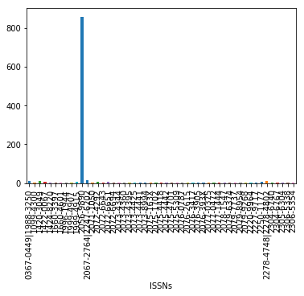
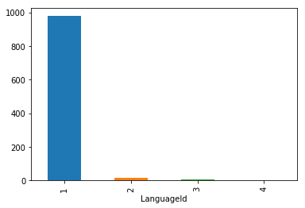

---
title: "Starting With Data"
teaching: ??
exercises: ??
questions:
- "How does Python deal with data tables?"
objectives:
- "Explain what a library is, and what libraries are used for."
- "Load a Python/Pandas library."
- "Read tabular data from a file into Python using Pandas using *read_csv*."
- "Learn about the Pandas DataFrame object."
- "Learn about data slicing and indexing."
- "Perform mathematical operations on numeric data."
- "Create simple plots of data."

keypoints:
- "Core concepts in python: Python libraries, Pandas DataFrames, working with data."

# training: http://swcarpentry.github.io/instructor-training
training: do-we-have-a-repo-of-python-training-resources ?
---

# Working with Pandas DataFrames in Python

## Presentation of the DOAJ Articles data

For this lesson, we will be using Directory of Open Access Journals (DOAJ) article sample data, available on [FigShare](https://dx.doi.org/10.6084/m9.figshare.3409471). Download this zip
and extract it on your working directory on a meaningful location (e.g. create
a folder called *data/*)

This data set is a list of published articles. The dataset is stored as *.csv*
(comma separated values) files: each row holds information for a single article,
and the columns represent:

| Column           | Description                        |
|------------------|------------------------------------|
| Title            | Title of the article               |
| Authors          | Author (or authors)                |
| DOI              | DOI                                |
| URL              | URL                                |
| Subjects         | List of subject key words          |
| ISSNs            | ISSNs code                         |
| Citation         | Citation information               |
| LanguageId       | Language identifier                |
| LicenceId        | License identifier                 |
| Author_Count     | Number of authors of the article   |
| First_Author     | Name of the first author           |
| Citation_Count   | Number times it has been cited     |
| Day              | Day of publication                 |
| Month            | Month of publication               |
| Year             | Year of publication                |

## About (Software) Libraries

A library in Python contains a set of tools (called functions) that perform
tasks on our data. Importing a library is like getting a piece of lab equipment
out of a storage locker and setting it up on the bench for use in a project.
Once a library is set up, it can be used or called to perform many tasks.

## Pandas in Python

One of the best options for working with tabular data in Python is to use the [pandas](http://pandas.pydata.org/) data analysis library.
Pandas provides data structures, produces high quality plots with [matplotlib](http://matplotlib.org/), and integrates nicely with other libraries that use [NumPy](http://www.numpy.org/) (which is another Python library) arrays.

Python doesn't load all of the libraries available to it by default. We have to
add an `import` statement to our code in order to use library functions. To import
a library, we use the syntax `import libraryName`. If we want to give the
library a nickname to shorten the command, we can add `as nickNameHere`.  An
example of importing the pandas library using the common nickname `pd` is below.


```python
import pandas as pd
```

{: .source}

Each time we call a function that's in a library, we use the syntax
`LibraryName.FunctionName`. Adding the library name with a `.` before the
function name tells Python where to find the function. In the example above, we
have imported Pandas as `pd`. This means we don't have to type out `pandas` each
time we call a Pandas function.

## Lesson Overview

For this lesson we will be using the Directory of Open Access Journals (DOAJ) article data.

We are analyzing the articles published in a particular field of study. The
data set is stored in *.csv* (comma separated values) format. Within
the *.csv* files, each row holds information for a single article.

The first few rows of our first file (articles.csv) look like this:


```python
id,Title,Authors,DOI,URL,Subjects,ISSNs,Citation,LanguageId,LicenceId,Author_Count,First_Author,Citation_Count,Day,Month,Year
0,The Fisher Thermodynamics of Quasi-Probabilities,Flavia Pennini|Angelo Plastino,10.3390/e17127853,https://doaj.org/article/b75e8d5cca3f46cbbd63e91be5b32412,Fisher information|quasi-probabilities|complementarity|Physics|QC1-999|Science|Q,1099-4300,"Entropy, Vol 17, Iss 12, Pp 7848-7858 (2015)",1,1,2,Flavia Pennini,4,1,11,2015
1,Aflatoxin Contamination of the Milk Supply: A Pakistan Perspective,Naveed Aslam|Peter C. Wynn,10.3390/agriculture5041172,https://doaj.org/article/0edc5af6672641c0bd45608812a34f9e,aflatoxins|AFM1|AFB1|milk marketing chains|hepatocellular carcinoma|Agriculture (General)|S1-972|Agriculture|S,2077-0472,"Agriculture (Basel), Vol 5, Iss 4, Pp 1172-1182 (2015)",1,1,2,Naveed Aslam,5,1,11,2015
2,Metagenomic Analysis of Upwelling-Affected Brazilian Coastal Seawater Reveals Sequence Domains of Type I PKS and Modular NRPS,Rafael R. C. Cuadrat|Juliano C. Cury|Alberto M. R. Dávila,10.3390/ijms161226101,https://doaj.org/article/d9fe469f75a0442382b84ba4f50007ee,PKS|NRPS|metagenomics|environmental genomics|upwelling|coastal environment|Chemistry|QD1-999|Science|Q,1422-0067,"International Journal of Molecular Sciences, Vol 16, Iss 12, Pp 28285-28295 (2015)",1,1,3,Rafael R. C. Cuadrat,8,1,11,2015
3,"Synthesis and Reactivity of a Cerium(III) Scorpionate Complex Containing a Redox Non-Innocent 2,2′-Bipyridine Ligand",Fabrizio Ortu|Hao Zhu|Marie-Emmanuelle Boulon|David P. Mills,10.3390/inorganics3040534,https://doaj.org/article/95606ed39deb4f43b96f7e6308ad15d3,lanthanide|cerium|scorpionate|tris(pyrazolyl)borate|radical|redox non-innocent|Inorganic chemistry|QD146-197,2304-6740,"Inorganics (Basel), Vol 3, Iss 4, Pp 534-553 (2015)",1,1,4,Fabrizio Ortu,5,1,11,2015

```

{: .output}
(quite difficult to read and interpret as it is...)

### We want to:

1. Load that data into memory using Python.
2. Calculate the average number of authors per article, for each publisher.
3. Plot this information.

We can automate the process above using Python. It is efficient to spend time
building the code to perform these tasks because once it is built, we can use it
over and over on different datasets that use a similar format. This makes our
methods easily reproducible. We can also easily share our code with colleagues
and they can replicate the same analysis.

# Reading CSV data using Pandas

We will begin by locating and reading our survey data which are in CSV format (comma separated values).
We can use Pandas' `read_csv` function to pull the file directly into a
[DataFrame](http://pandas.pydata.org/pandas-docs/stable/dsintro.html#dataframe).

## So what's a DataFrame?

A DataFrame is a 2-dimensional data structure that can store data of different
types (including characters, integers, floating point values, factors and more)
in columns. It is similar to a spreadsheet or an SQL table or the *data.frame* in
R. A DataFrame always has an index (0-based). An index refers to the position of
an element in the data structure.

First, let's make sure the Python Pandas library is loaded. We will import
Pandas using the nickname `pd`.  This is a common convention on the internet,
so if you look up Pandas usage, you will often see it this way.


```python
import pandas as pd
```

{: .source}

Let's also import the [OS Library](https://docs.python.org/3/library/os.html).
This library allows us to make sure we are in the correct working directory. If
you are working in IPython or Jupyter Notebook, be sure to start the notebook in the
workshop repository.  If you didn't do that you can always set the working
directory using the code below.


```python
import os
os.getcwd()
# if this directory isn't right, use the command below to set the working directory
#os.chdir("YOURPathHere")

# note that pd.read_csv is used because we imported pandas as pd
pd.read_csv("data/articles.csv")
```


<div>
<style scoped>
    .dataframe tbody tr th:only-of-type {
        vertical-align: middle;
    }

    .dataframe tbody tr th {
        vertical-align: top;
    }

    .dataframe thead th {
        text-align: right;
    }
</style>
<table border="1" class="dataframe">
  <thead>
    <tr style="text-align: right;">
      <th></th>
      <th>id</th>
      <th>Title</th>
      <th>Authors</th>
      <th>DOI</th>
      <th>URL</th>
      <th>Subjects</th>
      <th>ISSNs</th>
      <th>Citation</th>
      <th>LanguageId</th>
      <th>LicenceId</th>
      <th>Author_Count</th>
      <th>First_Author</th>
      <th>Citation_Count</th>
      <th>Day</th>
      <th>Month</th>
      <th>Year</th>
    </tr>
  </thead>
  <tbody>
    <tr>
      <th>0</th>
      <td>0</td>
      <td>The Fisher Thermodynamics of Quasi-Probabilities</td>
      <td>Flavia Pennini|Angelo Plastino</td>
      <td>10.3390/e17127853</td>
      <td>https://doaj.org/article/b75e8d5cca3f46cbbd63e...</td>
      <td>Fisher information|quasi-probabilities|complem...</td>
      <td>1099-4300</td>
      <td>Entropy, Vol 17, Iss 12, Pp 7848-7858 (2015)</td>
      <td>1</td>
      <td>1</td>
      <td>2</td>
      <td>Flavia Pennini</td>
      <td>4</td>
      <td>1</td>
      <td>11</td>
      <td>2015</td>
    </tr>
    <tr>
      <th>1</th>
      <td>1</td>
      <td>Aflatoxin Contamination of the Milk Supply: A ...</td>
      <td>Naveed Aslam|Peter C. Wynn</td>
      <td>10.3390/agriculture5041172</td>
      <td>https://doaj.org/article/0edc5af6672641c0bd456...</td>
      <td>aflatoxins|AFM1|AFB1|milk marketing chains|hep...</td>
      <td>2077-0472</td>
      <td>Agriculture (Basel), Vol 5, Iss 4, Pp 1172-118...</td>
      <td>1</td>
      <td>1</td>
      <td>2</td>
      <td>Naveed Aslam</td>
      <td>5</td>
      <td>1</td>
      <td>11</td>
      <td>2015</td>
    </tr>
    <tr>
      <th>2</th>
      <td>2</td>
      <td>Metagenomic Analysis of Upwelling-Affected Bra...</td>
      <td>Rafael R. C. Cuadrat|Juliano C. Cury|Alberto M...</td>
      <td>10.3390/ijms161226101</td>
      <td>https://doaj.org/article/d9fe469f75a0442382b84...</td>
      <td>PKS|NRPS|metagenomics|environmental genomics|u...</td>
      <td>1422-0067</td>
      <td>International Journal of Molecular Sciences, V...</td>
      <td>1</td>
      <td>1</td>
      <td>3</td>
      <td>Rafael R. C. Cuadrat</td>
      <td>8</td>
      <td>1</td>
      <td>11</td>
      <td>2015</td>
    </tr>
    <tr>
      <th>3</th>
      <td>3</td>
      <td>Synthesis and Reactivity of a Cerium(III) Scor...</td>
      <td>Fabrizio Ortu|Hao Zhu|Marie-Emmanuelle Boulon|...</td>
      <td>10.3390/inorganics3040534</td>
      <td>https://doaj.org/article/95606ed39deb4f43b96f7...</td>
      <td>lanthanide|cerium|scorpionate|tris(pyrazolyl)b...</td>
      <td>2304-6740</td>
      <td>Inorganics (Basel), Vol 3, Iss 4, Pp 534-553 (...</td>
      <td>1</td>
      <td>1</td>
      <td>4</td>
      <td>Fabrizio Ortu</td>
      <td>5</td>
      <td>1</td>
      <td>11</td>
      <td>2015</td>
    </tr>
    <tr>
      <th>4</th>
      <td>4</td>
      <td>Performance and Uncertainty Evaluation of Snow...</td>
      <td>Magali Troin|Richard Arsenault|François Brissette</td>
      <td>10.3390/hydrology2040289</td>
      <td>https://doaj.org/article/18b1d70730d44573ab5c2...</td>
      <td>snow models|hydrological models|snowmelt|uncer...</td>
      <td>2306-5338</td>
      <td>Hydrology, Vol 2, Iss 4, Pp 289-317 (2015)</td>
      <td>1</td>
      <td>1</td>
      <td>3</td>
      <td>Magali Troin</td>
      <td>4</td>
      <td>1</td>
      <td>11</td>
      <td>2015</td>
    </tr>
    <tr>
      <th>5</th>
      <td>5</td>
      <td>Dihydrochalcone Compounds Isolated from Crabap...</td>
      <td>Xiaoxiao Qin|Yun Feng Xing|Zhiqin Zhou|Yuncong...</td>
      <td>10.3390/molecules201219754</td>
      <td>https://doaj.org/article/5765b418183c4b70bb0b7...</td>
      <td>Malus crabapples|leaves|dihydrochalcone compou...</td>
      <td>1420-3049</td>
      <td>Molecules, Vol 20, Iss 12, Pp 21193-21203 (2015)</td>
      <td>1</td>
      <td>1</td>
      <td>4</td>
      <td>Xiaoxiao Qin</td>
      <td>4</td>
      <td>1</td>
      <td>11</td>
      <td>2015</td>
    </tr>
    <tr>
      <th>6</th>
      <td>6</td>
      <td>Ionic Liquids as Carbene Catalyst Precursors i...</td>
      <td>Anton Axelsson|Linda Ta|Henrik Sundén</td>
      <td>10.3390/catal5042052</td>
      <td>https://doaj.org/article/d1d39464834447c8bd9c2...</td>
      <td>ionic liquid|NHC|OTHO|multicomponent reaction|...</td>
      <td>2073-4344</td>
      <td>Catalysts, Vol 5, Iss 4, Pp 2052-2067 (2015)</td>
      <td>1</td>
      <td>1</td>
      <td>3</td>
      <td>Anton Axelsson</td>
      <td>4</td>
      <td>1</td>
      <td>11</td>
      <td>2015</td>
    </tr>
    <tr>
      <th>7</th>
      <td>7</td>
      <td>Characterization of Aspartate Kinase from Cory...</td>
      <td>Weihong Min|Huiying Li|Hongmei Li|Chunlei Liu|...</td>
      <td>10.3390/ijms161226098</td>
      <td>https://doaj.org/article/253cd7d35aa34a8eaa264...</td>
      <td>Corynebacterium pekinense|aspartate kinase|cha...</td>
      <td>1422-0067</td>
      <td>International Journal of Molecular Sciences, V...</td>
      <td>1</td>
      <td>1</td>
      <td>5</td>
      <td>Weihong Min</td>
      <td>8</td>
      <td>1</td>
      <td>11</td>
      <td>2015</td>
    </tr>
    <tr>
      <th>8</th>
      <td>8</td>
      <td>Quaternifications and Extensions of Current Al...</td>
      <td>Tosiaki Kori|Yuto Imai</td>
      <td>10.3390/sym7042150</td>
      <td>https://doaj.org/article/83bb4f8f7d09467da9778...</td>
      <td>infinite dimensional lie algebras|current alge...</td>
      <td>2073-8994</td>
      <td>Symmetry, Vol 7, Iss 4, Pp 2150-2180 (2015)</td>
      <td>1</td>
      <td>1</td>
      <td>2</td>
      <td>Tosiaki Kori</td>
      <td>4</td>
      <td>1</td>
      <td>11</td>
      <td>2015</td>
    </tr>
    <tr>
      <th>9</th>
      <td>9</td>
      <td>Imaging of HCC—Current State of the Art</td>
      <td>Christina Schraml|Sascha Kaufmann|Hansjoerg Re...</td>
      <td>10.3390/diagnostics5040513</td>
      <td>https://doaj.org/article/39227747725f45acbe245...</td>
      <td>hepatocellular carcinoma|magnetic resonance im...</td>
      <td>2075-4418</td>
      <td>Diagnostics, Vol 5, Iss 4, Pp 513-545 (2015)</td>
      <td>2</td>
      <td>1</td>
      <td>7</td>
      <td>Christina Schraml</td>
      <td>4</td>
      <td>1</td>
      <td>11</td>
      <td>2015</td>
    </tr>
    <tr>
      <th>10</th>
      <td>10</td>
      <td>Synthesis and Complexation of Well-Defined Lab...</td>
      <td>Mark Billing|Tobias Rudolph|Eric Täuscher|Rain...</td>
      <td>10.3390/polym7121526</td>
      <td>https://doaj.org/article/515fc66a42e84bdeb8ebd...</td>
      <td>atom transfer radical polymerization|intense c...</td>
      <td>2073-4360</td>
      <td>Polymers, Vol 7, Iss 12, Pp 2478-2493 (2015)</td>
      <td>1</td>
      <td>1</td>
      <td>5</td>
      <td>Mark Billing</td>
      <td>4</td>
      <td>1</td>
      <td>11</td>
      <td>2015</td>
    </tr>
    <tr>
      <th>11</th>
      <td>11</td>
      <td>UAV Control on the Basis of 3D Landmark Bearin...</td>
      <td>Simon Karpenko|Ivan Konovalenko|Alexander Mill...</td>
      <td>10.3390/s151229768</td>
      <td>https://doaj.org/article/c2932c5f6b6141849e851...</td>
      <td>UAV|visual odometry|projective geometry|video ...</td>
      <td>1424-8220</td>
      <td>Sensors, Vol 15, Iss 12, Pp 29802-29820 (2015)</td>
      <td>1</td>
      <td>1</td>
      <td>5</td>
      <td>Simon Karpenko</td>
      <td>4</td>
      <td>1</td>
      <td>11</td>
      <td>2015</td>
    </tr>
    <tr>
      <th>12</th>
      <td>12</td>
      <td>Polar Glycosylated and Lateral Non-Glycosylate...</td>
      <td>Kelly M. Fulton|Elena Mendoza-Barberá|Susan M....</td>
      <td>10.3390/ijms161226097</td>
      <td>https://doaj.org/article/25bb95aaec104618954a6...</td>
      <td>O-flagellin polar glycosylation|lateral flagel...</td>
      <td>1422-0067</td>
      <td>International Journal of Molecular Sciences, V...</td>
      <td>1</td>
      <td>1</td>
      <td>5</td>
      <td>Kelly M. Fulton</td>
      <td>8</td>
      <td>1</td>
      <td>11</td>
      <td>2015</td>
    </tr>
    <tr>
      <th>13</th>
      <td>13</td>
      <td>Selective Oxidation of Glycerol with 3% H2O2 C...</td>
      <td>Gongde Wu|Xiaoli Wang|Taineng Jiang|Qibo Lin</td>
      <td>10.3390/catal5042039</td>
      <td>https://doaj.org/article/2b508f4f44b143ec893d0...</td>
      <td>layered-double hydroxides|Cr(III) complex|1,3-...</td>
      <td>2073-4344</td>
      <td>Catalysts, Vol 5, Iss 4, Pp 2039-2051 (2015)</td>
      <td>1</td>
      <td>1</td>
      <td>4</td>
      <td>Gongde Wu</td>
      <td>4</td>
      <td>1</td>
      <td>11</td>
      <td>2015</td>
    </tr>
    <tr>
      <th>14</th>
      <td>14</td>
      <td>A Copper-Based Metal-Organic Framework as an E...</td>
      <td>Wei Long|Wenge Qiu|Chongwei Guo|Chuanqiang Li|...</td>
      <td>10.3390/molecules201219756</td>
      <td>https://doaj.org/article/537cad9d297045fba5791...</td>
      <td>metal-organic frameworks|C–N coupling|heteroge...</td>
      <td>1420-3049</td>
      <td>Molecules, Vol 20, Iss 12, Pp 21178-21192 (2015)</td>
      <td>1</td>
      <td>1</td>
      <td>8</td>
      <td>Wei Long</td>
      <td>4</td>
      <td>1</td>
      <td>11</td>
      <td>2015</td>
    </tr>
    <tr>
      <th>15</th>
      <td>15</td>
      <td>Performance-Based Cognitive Screening Instrume...</td>
      <td>Andrew J. Larner</td>
      <td>10.3390/diagnostics5040504</td>
      <td>https://doaj.org/article/115729fe9cad481681cd5...</td>
      <td>diagnosis|cognitive screening instruments|deme...</td>
      <td>2075-4418</td>
      <td>Diagnostics, Vol 5, Iss 4, Pp 504-512 (2015)</td>
      <td>2</td>
      <td>1</td>
      <td>1</td>
      <td>Andrew J. Larner</td>
      <td>4</td>
      <td>1</td>
      <td>11</td>
      <td>2015</td>
    </tr>
    <tr>
      <th>16</th>
      <td>16</td>
      <td>Aberrant GLI1 Activation in DNA Damage Respons...</td>
      <td>Komaraiah Palle|Chinnadurai Mani|Kaushlendra T...</td>
      <td>10.3390/cancers7040894</td>
      <td>https://doaj.org/article/cd34d5771f614ef0b8267...</td>
      <td>hedgehog signaling|GLI1|DNA damage|carcinogene...</td>
      <td>2072-6694</td>
      <td>Cancers, Vol 7, Iss 4, Pp 2330-2352 (2015)</td>
      <td>1</td>
      <td>1</td>
      <td>4</td>
      <td>Komaraiah Palle</td>
      <td>4</td>
      <td>1</td>
      <td>11</td>
      <td>2015</td>
    </tr>
    <tr>
      <th>17</th>
      <td>17</td>
      <td>Trends and Potential of the Market for Combine...</td>
      <td>Clemens Fuchs|Joachim Kasten|Mathias Urbanek</td>
      <td>10.3390/machines3040364</td>
      <td>https://doaj.org/article/3a5d3ab7bacd47768b97b...</td>
      <td>combine harvesters|technical development|stock...</td>
      <td>2075-1702</td>
      <td>Machines, Vol 3, Iss 4, Pp 364-378 (2015)</td>
      <td>2</td>
      <td>1</td>
      <td>3</td>
      <td>Clemens Fuchs</td>
      <td>4</td>
      <td>1</td>
      <td>11</td>
      <td>2015</td>
    </tr>
    <tr>
      <th>18</th>
      <td>18</td>
      <td>Improved Antioxidant Capacity of Optimization ...</td>
      <td>Ying Chen|Huiyong Zhang|Jing Yang|Haiyan Sun</td>
      <td>10.3390/molecules201219750</td>
      <td>https://doaj.org/article/f928f8c7abf54ff0a3775...</td>
      <td>resveratrol|nano-encapsulation|self-emulsifyin...</td>
      <td>1420-3049</td>
      <td>Molecules, Vol 20, Iss 12, Pp 21167-21177 (2015)</td>
      <td>1</td>
      <td>1</td>
      <td>4</td>
      <td>Ying Chen</td>
      <td>4</td>
      <td>1</td>
      <td>11</td>
      <td>2015</td>
    </tr>
    <tr>
      <th>19</th>
      <td>19</td>
      <td>Synthesis and Characterization of Cellulose-Ba...</td>
      <td>Maria Assunta Navarra|Chiara Dal Bosco|Judith ...</td>
      <td>10.3390/membranes5040810</td>
      <td>https://doaj.org/article/5a331257803448f8921b2...</td>
      <td>cellulose hydrogels|gel electrolyte membranes|...</td>
      <td>2077-0375</td>
      <td>Membranes, Vol 5, Iss 4, Pp 810-823 (2015)</td>
      <td>1</td>
      <td>1</td>
      <td>6</td>
      <td>Maria Assunta Navarra</td>
      <td>4</td>
      <td>1</td>
      <td>11</td>
      <td>2015</td>
    </tr>
    <tr>
      <th>20</th>
      <td>20</td>
      <td>Therapeutic Potential of Cell Penetrating Pept...</td>
      <td>Bénédicte Ndeboko|Guy Joseph Lemamy|Peter. E N...</td>
      <td>10.3390/ijms161226094</td>
      <td>https://doaj.org/article/f1e9ca55363c4f359f307...</td>
      <td>hepatitis B|antiviral therapy|cell penetrating...</td>
      <td>1422-0067</td>
      <td>International Journal of Molecular Sciences, V...</td>
      <td>1</td>
      <td>1</td>
      <td>4</td>
      <td>Bénédicte Ndeboko</td>
      <td>8</td>
      <td>1</td>
      <td>11</td>
      <td>2015</td>
    </tr>
    <tr>
      <th>21</th>
      <td>21</td>
      <td>ITSN2L Interacts with and Negatively Regulates...</td>
      <td>Xiaoxu Yang|Feng Yan|Zhicheng He|Shan Liu|Yeqi...</td>
      <td>10.3390/ijms161226091</td>
      <td>https://doaj.org/article/3285a0234bf248d69afb2...</td>
      <td>ITSN2L|RABEP1|endocytosis|endosome|interaction...</td>
      <td>1422-0067</td>
      <td>International Journal of Molecular Sciences, V...</td>
      <td>1</td>
      <td>1</td>
      <td>16</td>
      <td>Xiaoxu Yang</td>
      <td>8</td>
      <td>1</td>
      <td>11</td>
      <td>2015</td>
    </tr>
    <tr>
      <th>22</th>
      <td>22</td>
      <td>Old Things New View: Ascorbic Acid Protects th...</td>
      <td>Adriana Covarrubias-Pinto|Aníbal Ignacio Acuña...</td>
      <td>10.3390/ijms161226095</td>
      <td>https://doaj.org/article/30eb804514a34976b5d3f...</td>
      <td>oxidative stress|brain energy metabolism|Chemi...</td>
      <td>1422-0067</td>
      <td>International Journal of Molecular Sciences, V...</td>
      <td>1</td>
      <td>1</td>
      <td>5</td>
      <td>Adriana Covarrubias-Pinto</td>
      <td>8</td>
      <td>1</td>
      <td>11</td>
      <td>2015</td>
    </tr>
    <tr>
      <th>23</th>
      <td>23</td>
      <td>Therapeutic Targets for Neurodevelopmental Dis...</td>
      <td>Daisuke Ibi|Kiyofumi Yamada</td>
      <td>10.3390/ijms161226092</td>
      <td>https://doaj.org/article/b4df8bd1ac3f452a8b7d4...</td>
      <td>schizophrenia|autism|animal model|polyI:C|astr...</td>
      <td>1422-0067</td>
      <td>International Journal of Molecular Sciences, V...</td>
      <td>1</td>
      <td>1</td>
      <td>2</td>
      <td>Daisuke Ibi</td>
      <td>8</td>
      <td>1</td>
      <td>11</td>
      <td>2015</td>
    </tr>
    <tr>
      <th>24</th>
      <td>24</td>
      <td>Reliance on God’s Help Scale as a Measure of R...</td>
      <td>Arndt Büssing|Daniela Rodrigues Recchia|Klaus ...</td>
      <td>10.3390/rel6041358</td>
      <td>https://doaj.org/article/e146de4eb2444bfb88c54...</td>
      <td>Reliance on God’s help|religious trust|faith|q...</td>
      <td>2077-1444</td>
      <td>Religions, Vol 6, Iss 4, Pp 1358-1367 (2015)</td>
      <td>1</td>
      <td>1</td>
      <td>3</td>
      <td>Arndt Büssing</td>
      <td>4</td>
      <td>1</td>
      <td>11</td>
      <td>2015</td>
    </tr>
    <tr>
      <th>25</th>
      <td>25</td>
      <td>Apigenin Attenuates Melanoma Cell Migration by...</td>
      <td>Md. Abul Hasnat|Mehnaz Pervin|Ji Hong Lim|Beon...</td>
      <td>10.3390/molecules201219752</td>
      <td>https://doaj.org/article/5c5b22c71d3a46ec90a64...</td>
      <td>apigenin|melanoma|anoikis|migration|integrin-F...</td>
      <td>1420-3049</td>
      <td>Molecules, Vol 20, Iss 12, Pp 21157-21166 (2015)</td>
      <td>1</td>
      <td>1</td>
      <td>4</td>
      <td>Md. Abul Hasnat</td>
      <td>4</td>
      <td>1</td>
      <td>11</td>
      <td>2015</td>
    </tr>
    <tr>
      <th>26</th>
      <td>26</td>
      <td>Antioxidant Phytochemicals for the Prevention ...</td>
      <td>Yu-Jie Zhang|Ren-You Gan|Sha Li|Yue Zhou|An-Na...</td>
      <td>10.3390/molecules201219753</td>
      <td>https://doaj.org/article/fe19c78d1e0842c0b9530...</td>
      <td>antioxidant phytochemicals|health benefits|mec...</td>
      <td>1420-3049</td>
      <td>Molecules, Vol 20, Iss 12, Pp 21138-21156 (2015)</td>
      <td>1</td>
      <td>1</td>
      <td>7</td>
      <td>Yu-Jie Zhang</td>
      <td>4</td>
      <td>1</td>
      <td>11</td>
      <td>2015</td>
    </tr>
    <tr>
      <th>27</th>
      <td>27</td>
      <td>Comments on Ekino et al. Cloning and Character...</td>
      <td>Leopoldo Palma</td>
      <td>10.3390/toxins7124865</td>
      <td>https://doaj.org/article/45c6d07238a24bd9b8426...</td>
      <td>n/a|Biology (General)|QH301-705.5|Science|Q</td>
      <td>2072-6651</td>
      <td>Toxins, Vol 7, Iss 12, Pp 5094-5095 (2015)</td>
      <td>1</td>
      <td>1</td>
      <td>1</td>
      <td>Leopoldo Palma</td>
      <td>4</td>
      <td>1</td>
      <td>11</td>
      <td>2015</td>
    </tr>
    <tr>
      <th>28</th>
      <td>28</td>
      <td>Experimental Analysis of Dynamic Effects of FR...</td>
      <td>Marco Corradi|Antonio Borri|Giulio Castori|Kat...</td>
      <td>10.3390/ma8125445</td>
      <td>https://doaj.org/article/935ad576a0f247a2b6c1c...</td>
      <td>composite materials|vibration|brickwork masonr...</td>
      <td>1996-1944</td>
      <td>Materials, Vol 8, Iss 12, Pp 8059-8071 (2015)</td>
      <td>1</td>
      <td>1</td>
      <td>4</td>
      <td>Marco Corradi</td>
      <td>4</td>
      <td>1</td>
      <td>11</td>
      <td>2015</td>
    </tr>
    <tr>
      <th>29</th>
      <td>29</td>
      <td>Species Distribution Model for Management of a...</td>
      <td>Hsiao-Hsuan Wang|Tomasz E. Koralewski|Erin K. ...</td>
      <td>10.3390/f6124374</td>
      <td>https://doaj.org/article/0d4916eacb1849849a745...</td>
      <td>biodiversity|biological invasions|boosted regr...</td>
      <td>1999-4907</td>
      <td>Forests, Vol 6, Iss 12, Pp 4374-4390 (2015)</td>
      <td>1</td>
      <td>1</td>
      <td>5</td>
      <td>Hsiao-Hsuan Wang</td>
      <td>4</td>
      <td>1</td>
      <td>11</td>
      <td>2015</td>
    </tr>
    <tr>
      <th>...</th>
      <td>...</td>
      <td>...</td>
      <td>...</td>
      <td>...</td>
      <td>...</td>
      <td>...</td>
      <td>...</td>
      <td>...</td>
      <td>...</td>
      <td>...</td>
      <td>...</td>
      <td>...</td>
      <td>...</td>
      <td>...</td>
      <td>...</td>
      <td>...</td>
    </tr>
    <tr>
      <th>971</th>
      <td>971</td>
      <td>Crystal structure of (2S,4R)-ethyl 4-nitrometh...</td>
      <td>Araceli Zárate|David Aparicio|Angel Palillero|...</td>
      <td>10.1107/S2056989014026711</td>
      <td>https://doaj.org/article/7f56d955a5d84b689c15a...</td>
      <td>crystal structure|thiopiperidine|piperidine-2-...</td>
      <td>2056-9890</td>
      <td>Acta Crystallographica Section E: Crystallogra...</td>
      <td>1</td>
      <td>1</td>
      <td>4</td>
      <td>Araceli Zárate</td>
      <td>9</td>
      <td>1</td>
      <td>1</td>
      <td>2015</td>
    </tr>
    <tr>
      <th>972</th>
      <td>972</td>
      <td>Crystal structure of 4-(dimethylamino)pyridini...</td>
      <td>A. Thirunavukkarasu|A. Silambarasan|R. Mohan K...</td>
      <td>10.1107/S2056989014026310</td>
      <td>https://doaj.org/article/21c5e43a57624b2584910...</td>
      <td>crystal structure|4-(dimethylamino)pyridinium|...</td>
      <td>2056-9890</td>
      <td>Acta Crystallographica Section E: Crystallogra...</td>
      <td>1</td>
      <td>1</td>
      <td>5</td>
      <td>A. Thirunavukkarasu</td>
      <td>9</td>
      <td>1</td>
      <td>1</td>
      <td>2015</td>
    </tr>
    <tr>
      <th>973</th>
      <td>973</td>
      <td>Crystal structure of N′-(2,6-dimethylphenyl)be...</td>
      <td>Jian-Ping Zhao|Rui-Qin Liu|Zhi-Hao Jiang|Sheng...</td>
      <td>10.1107/S2056989014026255</td>
      <td>https://doaj.org/article/adaefae4e5004f968effa...</td>
      <td>crystal structure|benzenecarboximidamide|tetra...</td>
      <td>2056-9890</td>
      <td>Acta Crystallographica Section E: Crystallogra...</td>
      <td>1</td>
      <td>1</td>
      <td>4</td>
      <td>Jian-Ping Zhao</td>
      <td>9</td>
      <td>1</td>
      <td>1</td>
      <td>2015</td>
    </tr>
    <tr>
      <th>974</th>
      <td>974</td>
      <td>Crystal structure of 3-bromo-4-dimethylamino-1...</td>
      <td>Gerhard Laus|Thomas Gelbrich|Klaus Wurst|Herwi...</td>
      <td>10.1107/S205698901402636X</td>
      <td>https://doaj.org/article/76c84801332143ae949fb...</td>
      <td>crystal structure|1,2,4-triazol-5(4H)-one|Br.....</td>
      <td>2056-9890</td>
      <td>Acta Crystallographica Section E: Crystallogra...</td>
      <td>1</td>
      <td>1</td>
      <td>4</td>
      <td>Gerhard Laus</td>
      <td>9</td>
      <td>1</td>
      <td>1</td>
      <td>2015</td>
    </tr>
    <tr>
      <th>975</th>
      <td>975</td>
      <td>Crystal structure of 1-methanesulfonyl-1,2,3,4...</td>
      <td>S. Jeyaseelan|S. L. Nagendra Babu|G. Venkatesh...</td>
      <td>10.1107/S2056989014025353</td>
      <td>https://doaj.org/article/1297bd93dae440b08e08f...</td>
      <td>crystal structure|1,2,3,4-tetrahydroquinoline|...</td>
      <td>2056-9890</td>
      <td>Acta Crystallographica Section E: Crystallogra...</td>
      <td>1</td>
      <td>1</td>
      <td>5</td>
      <td>S. Jeyaseelan</td>
      <td>9</td>
      <td>1</td>
      <td>1</td>
      <td>2015</td>
    </tr>
    <tr>
      <th>976</th>
      <td>976</td>
      <td>Crystal structure of (Z)-3-(4-methoxybenzylide...</td>
      <td>V. Vinayagam|J. Mohan Raj|S. Murugavel|R. Selv...</td>
      <td>10.1107/S2056989014026267</td>
      <td>https://doaj.org/article/92b65e16820240f3bb0ca...</td>
      <td>crystal structure|benzo[b][1,4]thiazepin-4(5H)...</td>
      <td>2056-9890</td>
      <td>Acta Crystallographica Section E: Crystallogra...</td>
      <td>1</td>
      <td>1</td>
      <td>5</td>
      <td>V. Vinayagam</td>
      <td>9</td>
      <td>1</td>
      <td>1</td>
      <td>2015</td>
    </tr>
    <tr>
      <th>977</th>
      <td>977</td>
      <td>Crystal structure of 3-(morpholin-4-yl)-1-phen...</td>
      <td>F. M. Mashood Ahamed|M. Syed Ali Padusha|B. Gu...</td>
      <td>10.1107/S2056989014026292</td>
      <td>https://doaj.org/article/caba4d8755244165ac6da...</td>
      <td>crystal structure|morpholin-4-yl|pyridin-2-yl|...</td>
      <td>2056-9890</td>
      <td>Acta Crystallographica Section E: Crystallogra...</td>
      <td>1</td>
      <td>1</td>
      <td>3</td>
      <td>F. M. Mashood Ahamed</td>
      <td>9</td>
      <td>1</td>
      <td>1</td>
      <td>2015</td>
    </tr>
    <tr>
      <th>978</th>
      <td>978</td>
      <td>Crystal structure of 2,2-dichloro-1-(piperidin...</td>
      <td>Markus Schwierz|Helmar Görls|Wolfgang Imhof</td>
      <td>10.1107/S2056989014026164</td>
      <td>https://doaj.org/article/bf4c8b3a5d8948998e9b3...</td>
      <td>crystal structure|2,2-dichloro-1-(piperidin-1-...</td>
      <td>2056-9890</td>
      <td>Acta Crystallographica Section E: Crystallogra...</td>
      <td>1</td>
      <td>1</td>
      <td>3</td>
      <td>Markus Schwierz</td>
      <td>9</td>
      <td>1</td>
      <td>1</td>
      <td>2015</td>
    </tr>
    <tr>
      <th>979</th>
      <td>979</td>
      <td>Crystal structure of 2-azaniumyl-3-bromo-6-oxo...</td>
      <td>Md. Serajul Haque Faizi|Natalia O. Sharkina|Tu...</td>
      <td>10.1107/S2056989014026127</td>
      <td>https://doaj.org/article/6efc1a469adf4e4e8063f...</td>
      <td>crystal structure|bromide|pyrido[1,2-a]quinoxa...</td>
      <td>2056-9890</td>
      <td>Acta Crystallographica Section E: Crystallogra...</td>
      <td>1</td>
      <td>1</td>
      <td>3</td>
      <td>Md. Serajul Haque Faizi</td>
      <td>9</td>
      <td>1</td>
      <td>1</td>
      <td>2015</td>
    </tr>
    <tr>
      <th>980</th>
      <td>980</td>
      <td>Crystal structure of 2-methoxy-2-[(4-methylphe...</td>
      <td>Julio Zukerman-Schpector|Paulo R. Olivato|Henr...</td>
      <td>10.1107/S205698901402550X</td>
      <td>https://doaj.org/article/e5d48f3ac7dc45079129b...</td>
      <td>crystal structure|β-thiocarbonyl|C—H...O inter...</td>
      <td>2056-9890</td>
      <td>Acta Crystallographica Section E: Crystallogra...</td>
      <td>1</td>
      <td>1</td>
      <td>6</td>
      <td>Julio Zukerman-Schpector</td>
      <td>9</td>
      <td>1</td>
      <td>1</td>
      <td>2015</td>
    </tr>
    <tr>
      <th>981</th>
      <td>981</td>
      <td>Crystal structure of 1,3-bis(4-methylbenzyl)-1...</td>
      <td>Sevim Türktekin Çelikesir|Ömer Çelik|Senem Akk...</td>
      <td>10.1107/S2056989014025857</td>
      <td>https://doaj.org/article/9ae1a74608ad4c879766e...</td>
      <td>crystal structure|1,3-bis(4-methylbenzyl)-1H-3...</td>
      <td>2056-9890</td>
      <td>Acta Crystallographica Section E: Crystallogra...</td>
      <td>1</td>
      <td>1</td>
      <td>6</td>
      <td>Sevim Türktekin Çelikesir</td>
      <td>9</td>
      <td>1</td>
      <td>1</td>
      <td>2015</td>
    </tr>
    <tr>
      <th>982</th>
      <td>982</td>
      <td>Crystal structure of 1-(4-methoxyphenyl)-4-(4-...</td>
      <td>Sevim Türktekin Çelikesir|Mehmet Akkurt|Aliasg...</td>
      <td>10.1107/S2056989014025833</td>
      <td>https://doaj.org/article/6680dfc92c654ba69d91d...</td>
      <td>crystal structure|phenoxyazetidin-2-one|β-lact...</td>
      <td>2056-9890</td>
      <td>Acta Crystallographica Section E: Crystallogra...</td>
      <td>1</td>
      <td>1</td>
      <td>5</td>
      <td>Sevim Türktekin Çelikesir</td>
      <td>9</td>
      <td>1</td>
      <td>1</td>
      <td>2015</td>
    </tr>
    <tr>
      <th>983</th>
      <td>983</td>
      <td>Crystal structure of cyprodinil</td>
      <td>Youngeun Jeon|Gihaeng Kang|Seonghwa Cho|Tae Ho...</td>
      <td>10.1107/S2056989014025742</td>
      <td>https://doaj.org/article/ac4c87b9333c46fba0310...</td>
      <td>crystal structure|cyprodinil|pyrimidin-2-amine...</td>
      <td>2056-9890</td>
      <td>Acta Crystallographica Section E: Crystallogra...</td>
      <td>1</td>
      <td>1</td>
      <td>4</td>
      <td>Youngeun Jeon</td>
      <td>9</td>
      <td>1</td>
      <td>1</td>
      <td>2015</td>
    </tr>
    <tr>
      <th>984</th>
      <td>984</td>
      <td>Crystal structure of 3-(4-chlorophenoxy)-4-(2-...</td>
      <td>Sevim Türktekin Çelikesir|Mehmet Akkurt|Aliasg...</td>
      <td>10.1107/S2056989014025845</td>
      <td>https://doaj.org/article/d596edfc7dec4fb2b657e...</td>
      <td>crystal structure|β-lactam ring|C(4) chain|hyd...</td>
      <td>2056-9890</td>
      <td>Acta Crystallographica Section E: Crystallogra...</td>
      <td>1</td>
      <td>1</td>
      <td>5</td>
      <td>Sevim Türktekin Çelikesir</td>
      <td>9</td>
      <td>1</td>
      <td>1</td>
      <td>2015</td>
    </tr>
    <tr>
      <th>985</th>
      <td>985</td>
      <td>Crystal structure of 1,7,8,9-tetrachloro-4-(3,...</td>
      <td>He Liu|Jia-liang Zhong|Wen-xia Sun|Yan-qing Go...</td>
      <td>10.1107/S2056989014025961</td>
      <td>https://doaj.org/article/88b1ebe78c7a448c8e281...</td>
      <td>crystal structure|tricyclo[5.2.1.02,6]dec-8-en...</td>
      <td>2056-9890</td>
      <td>Acta Crystallographica Section E: Crystallogra...</td>
      <td>1</td>
      <td>1</td>
      <td>5</td>
      <td>He Liu</td>
      <td>9</td>
      <td>1</td>
      <td>1</td>
      <td>2015</td>
    </tr>
    <tr>
      <th>986</th>
      <td>986</td>
      <td>Crystal structure of 2-(1,3-dioxoindan-2-yl)is...</td>
      <td>Raza Murad Ghalib|C. S. Chidan Kumar|Rokiah Ha...</td>
      <td>10.1107/S2056989014025997</td>
      <td>https://doaj.org/article/8d3090a186134309b328f...</td>
      <td>crystal structure|isoquinoline-1,3,4-trione de...</td>
      <td>2056-9890</td>
      <td>Acta Crystallographica Section E: Crystallogra...</td>
      <td>1</td>
      <td>1</td>
      <td>5</td>
      <td>Raza Murad Ghalib</td>
      <td>9</td>
      <td>1</td>
      <td>1</td>
      <td>2015</td>
    </tr>
    <tr>
      <th>987</th>
      <td>987</td>
      <td>Crystal structure of ethyl 2-[2-((1E)-{(1E)-2-...</td>
      <td>Joel T. Mague|Shaaban K. Mohamed|Mehmet Akkurt...</td>
      <td>10.1107/S2056989014025584</td>
      <td>https://doaj.org/article/3b13e122791140bf91795...</td>
      <td>crystal structure|azomethenes|bis-phenoxy carb...</td>
      <td>2056-9890</td>
      <td>Acta Crystallographica Section E: Crystallogra...</td>
      <td>1</td>
      <td>1</td>
      <td>5</td>
      <td>Joel T. Mague</td>
      <td>9</td>
      <td>1</td>
      <td>1</td>
      <td>2015</td>
    </tr>
    <tr>
      <th>988</th>
      <td>988</td>
      <td>Crystal structure of the one-dimensional metal...</td>
      <td>Masaki Yamamura|Tatsuya Nabeshima</td>
      <td>10.1107/S2056989014027418</td>
      <td>https://doaj.org/article/97bd523aa7254d0191de0...</td>
      <td>crystal structure|zinc cluster|metal–organic p...</td>
      <td>2056-9890</td>
      <td>Acta Crystallographica Section E: Crystallogra...</td>
      <td>1</td>
      <td>1</td>
      <td>2</td>
      <td>Masaki Yamamura</td>
      <td>9</td>
      <td>1</td>
      <td>1</td>
      <td>2015</td>
    </tr>
    <tr>
      <th>989</th>
      <td>989</td>
      <td>Crystal structure of 6,9-dimethyl-7H-[1,2,4]tr...</td>
      <td>Abdellah Harmaoui|Rachid Bouhfid|El Mokhtar Es...</td>
      <td>10.1107/S2056989014025687</td>
      <td>https://doaj.org/article/5eaf30fd11e948319308c...</td>
      <td>crystal structure|1,2,4-triazepin-8(9H)-one|ph...</td>
      <td>2056-9890</td>
      <td>Acta Crystallographica Section E: Crystallogra...</td>
      <td>1</td>
      <td>1</td>
      <td>5</td>
      <td>Abdellah Harmaoui</td>
      <td>9</td>
      <td>1</td>
      <td>1</td>
      <td>2015</td>
    </tr>
    <tr>
      <th>990</th>
      <td>990</td>
      <td>Crystal structure of bis(2,2′-bipyridine-κ2N,N...</td>
      <td>Stefan Suckert|Inke Jess|Christian Näther</td>
      <td>10.1107/S205698901402516X</td>
      <td>https://doaj.org/article/c1224ed5e2124db8b040d...</td>
      <td>crystal structure|coordination polymer|octahed...</td>
      <td>2056-9890</td>
      <td>Acta Crystallographica Section E: Crystallogra...</td>
      <td>1</td>
      <td>1</td>
      <td>3</td>
      <td>Stefan Suckert</td>
      <td>9</td>
      <td>1</td>
      <td>1</td>
      <td>2015</td>
    </tr>
    <tr>
      <th>991</th>
      <td>991</td>
      <td>Crystal structure of bis(η5-cyclopentadienyl)(...</td>
      <td>Vladimir V. Burlakov|Wolfgang Baumann|Perdita ...</td>
      <td>10.1107/S2056989014026929</td>
      <td>https://doaj.org/article/a1a9e50651614d6da8f47...</td>
      <td>crystal structure|hafnocene|five-membered meta...</td>
      <td>2056-9890</td>
      <td>Acta Crystallographica Section E: Crystallogra...</td>
      <td>1</td>
      <td>1</td>
      <td>5</td>
      <td>Vladimir V. Burlakov</td>
      <td>9</td>
      <td>1</td>
      <td>1</td>
      <td>2015</td>
    </tr>
    <tr>
      <th>992</th>
      <td>992</td>
      <td>Crystal structure of tris(1,10-phenanthroline-...</td>
      <td>Kazunori Teramoto|Takeshi Kawasaki|Toshikazu N...</td>
      <td>10.1107/S2056989014026966</td>
      <td>https://doaj.org/article/f5fe66c6f8ee4552bc427...</td>
      <td>crystal structure|1,10-phenanthroline|iron(II)...</td>
      <td>2056-9890</td>
      <td>Acta Crystallographica Section E: Crystallogra...</td>
      <td>1</td>
      <td>1</td>
      <td>4</td>
      <td>Kazunori Teramoto</td>
      <td>9</td>
      <td>1</td>
      <td>1</td>
      <td>2015</td>
    </tr>
    <tr>
      <th>993</th>
      <td>993</td>
      <td>Crystal structure of dichlorido{4-[(E)-(methox...</td>
      <td>Viktorita V. Dyakonenko|Olga O. Zholob|Svitlan...</td>
      <td>10.1107/S2056989014026619</td>
      <td>https://doaj.org/article/990a139c0ba5426db3684...</td>
      <td>crystal structure|palladium|multi-functional l...</td>
      <td>2056-9890</td>
      <td>Acta Crystallographica Section E: Crystallogra...</td>
      <td>1</td>
      <td>1</td>
      <td>4</td>
      <td>Viktorita V. Dyakonenko</td>
      <td>9</td>
      <td>1</td>
      <td>1</td>
      <td>2015</td>
    </tr>
    <tr>
      <th>994</th>
      <td>994</td>
      <td>Crystal structure of poly[(N,N-dimethylacetami...</td>
      <td>Lan Jin|Li-Li Zha|San Gao|Shi-Yao Yang|Rong-Bi...</td>
      <td>10.1107/S2056989014025626</td>
      <td>https://doaj.org/article/5ac8b37917a34c32a301d...</td>
      <td>crystal structure|manganese(II) coordination p...</td>
      <td>2056-9890</td>
      <td>Acta Crystallographica Section E: Crystallogra...</td>
      <td>1</td>
      <td>1</td>
      <td>5</td>
      <td>Lan Jin</td>
      <td>9</td>
      <td>1</td>
      <td>1</td>
      <td>2015</td>
    </tr>
    <tr>
      <th>995</th>
      <td>995</td>
      <td>Crystal structure of the coordination polymer ...</td>
      <td>Maksym Seredyuk|M. Carmen Muñoz|José A. Real|T...</td>
      <td>10.1107/S2056989014026188</td>
      <td>https://doaj.org/article/81ca553f145e4b92a8316...</td>
      <td>crystal structure|polycyanidometalate|spin-cro...</td>
      <td>2056-9890</td>
      <td>Acta Crystallographica Section E: Crystallogra...</td>
      <td>1</td>
      <td>1</td>
      <td>4</td>
      <td>Maksym Seredyuk</td>
      <td>9</td>
      <td>1</td>
      <td>1</td>
      <td>2015</td>
    </tr>
    <tr>
      <th>996</th>
      <td>996</td>
      <td>Crystal structure of [3-(1H-benzimidazol-2-yl)...</td>
      <td>Zhimin Liu|Shengrun Zheng|Sisi Feng</td>
      <td>10.1107/S2056989014026656</td>
      <td>https://doaj.org/article/cb1912c6567f4f99aa0ff...</td>
      <td>crystal structure|3-(1H-benzimidazol-2-yl)prop...</td>
      <td>2056-9890</td>
      <td>Acta Crystallographica Section E: Crystallogra...</td>
      <td>1</td>
      <td>1</td>
      <td>3</td>
      <td>Zhimin Liu</td>
      <td>9</td>
      <td>1</td>
      <td>1</td>
      <td>2015</td>
    </tr>
    <tr>
      <th>997</th>
      <td>997</td>
      <td>Crystal structure of bis(3-bromopyridine-κN)bi...</td>
      <td>Rajni Kant|Gurvinder Kour|Sumati Anthal|Neerup...</td>
      <td>10.1107/S2056989014027339</td>
      <td>https://doaj.org/article/004df1cd5dfd42e2b78d5...</td>
      <td>Crystal structure|nickel complex|xanthate liga...</td>
      <td>2056-9890</td>
      <td>Acta Crystallographica Section E: Crystallogra...</td>
      <td>1</td>
      <td>1</td>
      <td>5</td>
      <td>Rajni Kant</td>
      <td>9</td>
      <td>1</td>
      <td>1</td>
      <td>2015</td>
    </tr>
    <tr>
      <th>998</th>
      <td>998</td>
      <td>Crystal structure of 4,4′-(ethane-1,2-diyl)bis...</td>
      <td>Ines Hauptvogel|Wilhelm Seichter|Edwin Weber</td>
      <td>10.1107/S2056989014027182</td>
      <td>https://doaj.org/article/4f6b74ada72746ba85bbd...</td>
      <td>crystal structure|4,4′-(ethane-1,2-diyl)bis(2,...</td>
      <td>2056-9890</td>
      <td>Acta Crystallographica Section E: Crystallogra...</td>
      <td>1</td>
      <td>1</td>
      <td>3</td>
      <td>Ines Hauptvogel</td>
      <td>9</td>
      <td>1</td>
      <td>1</td>
      <td>2015</td>
    </tr>
    <tr>
      <th>999</th>
      <td>999</td>
      <td>Crystal structure of (Z)-4-[1-(4-acetylanilino...</td>
      <td>Refaat M. Mahfouz|Zeynep Demircioğlu|Mohamed S...</td>
      <td>10.1107/S2056989014026899</td>
      <td>https://doaj.org/article/5a5102b0e73d4f2fbc55e...</td>
      <td>crystal structure|Schiff bases|pyrazolone deri...</td>
      <td>2056-9890</td>
      <td>Acta Crystallographica Section E: Crystallogra...</td>
      <td>1</td>
      <td>1</td>
      <td>4</td>
      <td>Refaat M. Mahfouz</td>
      <td>9</td>
      <td>1</td>
      <td>1</td>
      <td>2015</td>
    </tr>
    <tr>
      <th>1000</th>
      <td>1000</td>
      <td>Metagenomic Analysis of Upwelling-Affected Bra...</td>
      <td>Rafael R. C. Cuadrat|Juliano C. Cury|Alberto M...</td>
      <td>10.3390/ijms161226101</td>
      <td>https://doaj.org/article/d9fe469f75a0442382b84...</td>
      <td>PKS|NRPS|metagenomics|environmental genomics|u...</td>
      <td>1422-0067</td>
      <td>International Journal of Molecular Sciences, V...</td>
      <td>1</td>
      <td>1</td>
      <td>3</td>
      <td>Rafael R. C. Cuadrat</td>
      <td>8</td>
      <td>1</td>
      <td>11</td>
      <td>2015</td>
    </tr>
  </tbody>
</table>
<p>1001 rows × 16 columns</p>
</div>


{: .source}

{: .output}

We can see that there were 1,001 rows parsed. Each row has 11
columns. The first column is the index of the DataFrame. The index is used to
identify the position of the data, but it is not an actual column of the DataFrame.
It looks like  the `read_csv` function in Pandas  read our file properly. However,
we haven't saved any data to memory so we can work with it. We need to assign the
DataFrame to a variable. Remember that a variable is a name for a value, such as `x`,
or  `data`. We can create a new  object with a variable name by assigning a value to it using `=`.

Let's call the imported survey data `articles_df`:


```python
articles_df = pd.read_csv("data/articles.csv")
```

{: .source}

Notice when you assign the imported DataFrame to a variable, Python does not
produce any output on the screen. We can print the value of the `articles_df`
object by typing its name into the Python command prompt.


```python
articles_df
```


<div>
<style scoped>
    .dataframe tbody tr th:only-of-type {
        vertical-align: middle;
    }

    .dataframe tbody tr th {
        vertical-align: top;
    }

    .dataframe thead th {
        text-align: right;
    }
</style>
<table border="1" class="dataframe">
  <thead>
    <tr style="text-align: right;">
      <th></th>
      <th>id</th>
      <th>Title</th>
      <th>Authors</th>
      <th>DOI</th>
      <th>URL</th>
      <th>Subjects</th>
      <th>ISSNs</th>
      <th>Citation</th>
      <th>LanguageId</th>
      <th>LicenceId</th>
      <th>Author_Count</th>
      <th>First_Author</th>
      <th>Citation_Count</th>
      <th>Day</th>
      <th>Month</th>
      <th>Year</th>
    </tr>
  </thead>
  <tbody>
    <tr>
      <th>0</th>
      <td>0</td>
      <td>The Fisher Thermodynamics of Quasi-Probabilities</td>
      <td>Flavia Pennini|Angelo Plastino</td>
      <td>10.3390/e17127853</td>
      <td>https://doaj.org/article/b75e8d5cca3f46cbbd63e...</td>
      <td>Fisher information|quasi-probabilities|complem...</td>
      <td>1099-4300</td>
      <td>Entropy, Vol 17, Iss 12, Pp 7848-7858 (2015)</td>
      <td>1</td>
      <td>1</td>
      <td>2</td>
      <td>Flavia Pennini</td>
      <td>4</td>
      <td>1</td>
      <td>11</td>
      <td>2015</td>
    </tr>
    <tr>
      <th>1</th>
      <td>1</td>
      <td>Aflatoxin Contamination of the Milk Supply: A ...</td>
      <td>Naveed Aslam|Peter C. Wynn</td>
      <td>10.3390/agriculture5041172</td>
      <td>https://doaj.org/article/0edc5af6672641c0bd456...</td>
      <td>aflatoxins|AFM1|AFB1|milk marketing chains|hep...</td>
      <td>2077-0472</td>
      <td>Agriculture (Basel), Vol 5, Iss 4, Pp 1172-118...</td>
      <td>1</td>
      <td>1</td>
      <td>2</td>
      <td>Naveed Aslam</td>
      <td>5</td>
      <td>1</td>
      <td>11</td>
      <td>2015</td>
    </tr>
    <tr>
      <th>2</th>
      <td>2</td>
      <td>Metagenomic Analysis of Upwelling-Affected Bra...</td>
      <td>Rafael R. C. Cuadrat|Juliano C. Cury|Alberto M...</td>
      <td>10.3390/ijms161226101</td>
      <td>https://doaj.org/article/d9fe469f75a0442382b84...</td>
      <td>PKS|NRPS|metagenomics|environmental genomics|u...</td>
      <td>1422-0067</td>
      <td>International Journal of Molecular Sciences, V...</td>
      <td>1</td>
      <td>1</td>
      <td>3</td>
      <td>Rafael R. C. Cuadrat</td>
      <td>8</td>
      <td>1</td>
      <td>11</td>
      <td>2015</td>
    </tr>
    <tr>
      <th>3</th>
      <td>3</td>
      <td>Synthesis and Reactivity of a Cerium(III) Scor...</td>
      <td>Fabrizio Ortu|Hao Zhu|Marie-Emmanuelle Boulon|...</td>
      <td>10.3390/inorganics3040534</td>
      <td>https://doaj.org/article/95606ed39deb4f43b96f7...</td>
      <td>lanthanide|cerium|scorpionate|tris(pyrazolyl)b...</td>
      <td>2304-6740</td>
      <td>Inorganics (Basel), Vol 3, Iss 4, Pp 534-553 (...</td>
      <td>1</td>
      <td>1</td>
      <td>4</td>
      <td>Fabrizio Ortu</td>
      <td>5</td>
      <td>1</td>
      <td>11</td>
      <td>2015</td>
    </tr>
    <tr>
      <th>4</th>
      <td>4</td>
      <td>Performance and Uncertainty Evaluation of Snow...</td>
      <td>Magali Troin|Richard Arsenault|François Brissette</td>
      <td>10.3390/hydrology2040289</td>
      <td>https://doaj.org/article/18b1d70730d44573ab5c2...</td>
      <td>snow models|hydrological models|snowmelt|uncer...</td>
      <td>2306-5338</td>
      <td>Hydrology, Vol 2, Iss 4, Pp 289-317 (2015)</td>
      <td>1</td>
      <td>1</td>
      <td>3</td>
      <td>Magali Troin</td>
      <td>4</td>
      <td>1</td>
      <td>11</td>
      <td>2015</td>
    </tr>
    <tr>
      <th>5</th>
      <td>5</td>
      <td>Dihydrochalcone Compounds Isolated from Crabap...</td>
      <td>Xiaoxiao Qin|Yun Feng Xing|Zhiqin Zhou|Yuncong...</td>
      <td>10.3390/molecules201219754</td>
      <td>https://doaj.org/article/5765b418183c4b70bb0b7...</td>
      <td>Malus crabapples|leaves|dihydrochalcone compou...</td>
      <td>1420-3049</td>
      <td>Molecules, Vol 20, Iss 12, Pp 21193-21203 (2015)</td>
      <td>1</td>
      <td>1</td>
      <td>4</td>
      <td>Xiaoxiao Qin</td>
      <td>4</td>
      <td>1</td>
      <td>11</td>
      <td>2015</td>
    </tr>
    <tr>
      <th>6</th>
      <td>6</td>
      <td>Ionic Liquids as Carbene Catalyst Precursors i...</td>
      <td>Anton Axelsson|Linda Ta|Henrik Sundén</td>
      <td>10.3390/catal5042052</td>
      <td>https://doaj.org/article/d1d39464834447c8bd9c2...</td>
      <td>ionic liquid|NHC|OTHO|multicomponent reaction|...</td>
      <td>2073-4344</td>
      <td>Catalysts, Vol 5, Iss 4, Pp 2052-2067 (2015)</td>
      <td>1</td>
      <td>1</td>
      <td>3</td>
      <td>Anton Axelsson</td>
      <td>4</td>
      <td>1</td>
      <td>11</td>
      <td>2015</td>
    </tr>
    <tr>
      <th>7</th>
      <td>7</td>
      <td>Characterization of Aspartate Kinase from Cory...</td>
      <td>Weihong Min|Huiying Li|Hongmei Li|Chunlei Liu|...</td>
      <td>10.3390/ijms161226098</td>
      <td>https://doaj.org/article/253cd7d35aa34a8eaa264...</td>
      <td>Corynebacterium pekinense|aspartate kinase|cha...</td>
      <td>1422-0067</td>
      <td>International Journal of Molecular Sciences, V...</td>
      <td>1</td>
      <td>1</td>
      <td>5</td>
      <td>Weihong Min</td>
      <td>8</td>
      <td>1</td>
      <td>11</td>
      <td>2015</td>
    </tr>
    <tr>
      <th>8</th>
      <td>8</td>
      <td>Quaternifications and Extensions of Current Al...</td>
      <td>Tosiaki Kori|Yuto Imai</td>
      <td>10.3390/sym7042150</td>
      <td>https://doaj.org/article/83bb4f8f7d09467da9778...</td>
      <td>infinite dimensional lie algebras|current alge...</td>
      <td>2073-8994</td>
      <td>Symmetry, Vol 7, Iss 4, Pp 2150-2180 (2015)</td>
      <td>1</td>
      <td>1</td>
      <td>2</td>
      <td>Tosiaki Kori</td>
      <td>4</td>
      <td>1</td>
      <td>11</td>
      <td>2015</td>
    </tr>
    <tr>
      <th>9</th>
      <td>9</td>
      <td>Imaging of HCC—Current State of the Art</td>
      <td>Christina Schraml|Sascha Kaufmann|Hansjoerg Re...</td>
      <td>10.3390/diagnostics5040513</td>
      <td>https://doaj.org/article/39227747725f45acbe245...</td>
      <td>hepatocellular carcinoma|magnetic resonance im...</td>
      <td>2075-4418</td>
      <td>Diagnostics, Vol 5, Iss 4, Pp 513-545 (2015)</td>
      <td>2</td>
      <td>1</td>
      <td>7</td>
      <td>Christina Schraml</td>
      <td>4</td>
      <td>1</td>
      <td>11</td>
      <td>2015</td>
    </tr>
    <tr>
      <th>10</th>
      <td>10</td>
      <td>Synthesis and Complexation of Well-Defined Lab...</td>
      <td>Mark Billing|Tobias Rudolph|Eric Täuscher|Rain...</td>
      <td>10.3390/polym7121526</td>
      <td>https://doaj.org/article/515fc66a42e84bdeb8ebd...</td>
      <td>atom transfer radical polymerization|intense c...</td>
      <td>2073-4360</td>
      <td>Polymers, Vol 7, Iss 12, Pp 2478-2493 (2015)</td>
      <td>1</td>
      <td>1</td>
      <td>5</td>
      <td>Mark Billing</td>
      <td>4</td>
      <td>1</td>
      <td>11</td>
      <td>2015</td>
    </tr>
    <tr>
      <th>11</th>
      <td>11</td>
      <td>UAV Control on the Basis of 3D Landmark Bearin...</td>
      <td>Simon Karpenko|Ivan Konovalenko|Alexander Mill...</td>
      <td>10.3390/s151229768</td>
      <td>https://doaj.org/article/c2932c5f6b6141849e851...</td>
      <td>UAV|visual odometry|projective geometry|video ...</td>
      <td>1424-8220</td>
      <td>Sensors, Vol 15, Iss 12, Pp 29802-29820 (2015)</td>
      <td>1</td>
      <td>1</td>
      <td>5</td>
      <td>Simon Karpenko</td>
      <td>4</td>
      <td>1</td>
      <td>11</td>
      <td>2015</td>
    </tr>
    <tr>
      <th>12</th>
      <td>12</td>
      <td>Polar Glycosylated and Lateral Non-Glycosylate...</td>
      <td>Kelly M. Fulton|Elena Mendoza-Barberá|Susan M....</td>
      <td>10.3390/ijms161226097</td>
      <td>https://doaj.org/article/25bb95aaec104618954a6...</td>
      <td>O-flagellin polar glycosylation|lateral flagel...</td>
      <td>1422-0067</td>
      <td>International Journal of Molecular Sciences, V...</td>
      <td>1</td>
      <td>1</td>
      <td>5</td>
      <td>Kelly M. Fulton</td>
      <td>8</td>
      <td>1</td>
      <td>11</td>
      <td>2015</td>
    </tr>
    <tr>
      <th>13</th>
      <td>13</td>
      <td>Selective Oxidation of Glycerol with 3% H2O2 C...</td>
      <td>Gongde Wu|Xiaoli Wang|Taineng Jiang|Qibo Lin</td>
      <td>10.3390/catal5042039</td>
      <td>https://doaj.org/article/2b508f4f44b143ec893d0...</td>
      <td>layered-double hydroxides|Cr(III) complex|1,3-...</td>
      <td>2073-4344</td>
      <td>Catalysts, Vol 5, Iss 4, Pp 2039-2051 (2015)</td>
      <td>1</td>
      <td>1</td>
      <td>4</td>
      <td>Gongde Wu</td>
      <td>4</td>
      <td>1</td>
      <td>11</td>
      <td>2015</td>
    </tr>
    <tr>
      <th>14</th>
      <td>14</td>
      <td>A Copper-Based Metal-Organic Framework as an E...</td>
      <td>Wei Long|Wenge Qiu|Chongwei Guo|Chuanqiang Li|...</td>
      <td>10.3390/molecules201219756</td>
      <td>https://doaj.org/article/537cad9d297045fba5791...</td>
      <td>metal-organic frameworks|C–N coupling|heteroge...</td>
      <td>1420-3049</td>
      <td>Molecules, Vol 20, Iss 12, Pp 21178-21192 (2015)</td>
      <td>1</td>
      <td>1</td>
      <td>8</td>
      <td>Wei Long</td>
      <td>4</td>
      <td>1</td>
      <td>11</td>
      <td>2015</td>
    </tr>
    <tr>
      <th>15</th>
      <td>15</td>
      <td>Performance-Based Cognitive Screening Instrume...</td>
      <td>Andrew J. Larner</td>
      <td>10.3390/diagnostics5040504</td>
      <td>https://doaj.org/article/115729fe9cad481681cd5...</td>
      <td>diagnosis|cognitive screening instruments|deme...</td>
      <td>2075-4418</td>
      <td>Diagnostics, Vol 5, Iss 4, Pp 504-512 (2015)</td>
      <td>2</td>
      <td>1</td>
      <td>1</td>
      <td>Andrew J. Larner</td>
      <td>4</td>
      <td>1</td>
      <td>11</td>
      <td>2015</td>
    </tr>
    <tr>
      <th>16</th>
      <td>16</td>
      <td>Aberrant GLI1 Activation in DNA Damage Respons...</td>
      <td>Komaraiah Palle|Chinnadurai Mani|Kaushlendra T...</td>
      <td>10.3390/cancers7040894</td>
      <td>https://doaj.org/article/cd34d5771f614ef0b8267...</td>
      <td>hedgehog signaling|GLI1|DNA damage|carcinogene...</td>
      <td>2072-6694</td>
      <td>Cancers, Vol 7, Iss 4, Pp 2330-2352 (2015)</td>
      <td>1</td>
      <td>1</td>
      <td>4</td>
      <td>Komaraiah Palle</td>
      <td>4</td>
      <td>1</td>
      <td>11</td>
      <td>2015</td>
    </tr>
    <tr>
      <th>17</th>
      <td>17</td>
      <td>Trends and Potential of the Market for Combine...</td>
      <td>Clemens Fuchs|Joachim Kasten|Mathias Urbanek</td>
      <td>10.3390/machines3040364</td>
      <td>https://doaj.org/article/3a5d3ab7bacd47768b97b...</td>
      <td>combine harvesters|technical development|stock...</td>
      <td>2075-1702</td>
      <td>Machines, Vol 3, Iss 4, Pp 364-378 (2015)</td>
      <td>2</td>
      <td>1</td>
      <td>3</td>
      <td>Clemens Fuchs</td>
      <td>4</td>
      <td>1</td>
      <td>11</td>
      <td>2015</td>
    </tr>
    <tr>
      <th>18</th>
      <td>18</td>
      <td>Improved Antioxidant Capacity of Optimization ...</td>
      <td>Ying Chen|Huiyong Zhang|Jing Yang|Haiyan Sun</td>
      <td>10.3390/molecules201219750</td>
      <td>https://doaj.org/article/f928f8c7abf54ff0a3775...</td>
      <td>resveratrol|nano-encapsulation|self-emulsifyin...</td>
      <td>1420-3049</td>
      <td>Molecules, Vol 20, Iss 12, Pp 21167-21177 (2015)</td>
      <td>1</td>
      <td>1</td>
      <td>4</td>
      <td>Ying Chen</td>
      <td>4</td>
      <td>1</td>
      <td>11</td>
      <td>2015</td>
    </tr>
    <tr>
      <th>19</th>
      <td>19</td>
      <td>Synthesis and Characterization of Cellulose-Ba...</td>
      <td>Maria Assunta Navarra|Chiara Dal Bosco|Judith ...</td>
      <td>10.3390/membranes5040810</td>
      <td>https://doaj.org/article/5a331257803448f8921b2...</td>
      <td>cellulose hydrogels|gel electrolyte membranes|...</td>
      <td>2077-0375</td>
      <td>Membranes, Vol 5, Iss 4, Pp 810-823 (2015)</td>
      <td>1</td>
      <td>1</td>
      <td>6</td>
      <td>Maria Assunta Navarra</td>
      <td>4</td>
      <td>1</td>
      <td>11</td>
      <td>2015</td>
    </tr>
    <tr>
      <th>20</th>
      <td>20</td>
      <td>Therapeutic Potential of Cell Penetrating Pept...</td>
      <td>Bénédicte Ndeboko|Guy Joseph Lemamy|Peter. E N...</td>
      <td>10.3390/ijms161226094</td>
      <td>https://doaj.org/article/f1e9ca55363c4f359f307...</td>
      <td>hepatitis B|antiviral therapy|cell penetrating...</td>
      <td>1422-0067</td>
      <td>International Journal of Molecular Sciences, V...</td>
      <td>1</td>
      <td>1</td>
      <td>4</td>
      <td>Bénédicte Ndeboko</td>
      <td>8</td>
      <td>1</td>
      <td>11</td>
      <td>2015</td>
    </tr>
    <tr>
      <th>21</th>
      <td>21</td>
      <td>ITSN2L Interacts with and Negatively Regulates...</td>
      <td>Xiaoxu Yang|Feng Yan|Zhicheng He|Shan Liu|Yeqi...</td>
      <td>10.3390/ijms161226091</td>
      <td>https://doaj.org/article/3285a0234bf248d69afb2...</td>
      <td>ITSN2L|RABEP1|endocytosis|endosome|interaction...</td>
      <td>1422-0067</td>
      <td>International Journal of Molecular Sciences, V...</td>
      <td>1</td>
      <td>1</td>
      <td>16</td>
      <td>Xiaoxu Yang</td>
      <td>8</td>
      <td>1</td>
      <td>11</td>
      <td>2015</td>
    </tr>
    <tr>
      <th>22</th>
      <td>22</td>
      <td>Old Things New View: Ascorbic Acid Protects th...</td>
      <td>Adriana Covarrubias-Pinto|Aníbal Ignacio Acuña...</td>
      <td>10.3390/ijms161226095</td>
      <td>https://doaj.org/article/30eb804514a34976b5d3f...</td>
      <td>oxidative stress|brain energy metabolism|Chemi...</td>
      <td>1422-0067</td>
      <td>International Journal of Molecular Sciences, V...</td>
      <td>1</td>
      <td>1</td>
      <td>5</td>
      <td>Adriana Covarrubias-Pinto</td>
      <td>8</td>
      <td>1</td>
      <td>11</td>
      <td>2015</td>
    </tr>
    <tr>
      <th>23</th>
      <td>23</td>
      <td>Therapeutic Targets for Neurodevelopmental Dis...</td>
      <td>Daisuke Ibi|Kiyofumi Yamada</td>
      <td>10.3390/ijms161226092</td>
      <td>https://doaj.org/article/b4df8bd1ac3f452a8b7d4...</td>
      <td>schizophrenia|autism|animal model|polyI:C|astr...</td>
      <td>1422-0067</td>
      <td>International Journal of Molecular Sciences, V...</td>
      <td>1</td>
      <td>1</td>
      <td>2</td>
      <td>Daisuke Ibi</td>
      <td>8</td>
      <td>1</td>
      <td>11</td>
      <td>2015</td>
    </tr>
    <tr>
      <th>24</th>
      <td>24</td>
      <td>Reliance on God’s Help Scale as a Measure of R...</td>
      <td>Arndt Büssing|Daniela Rodrigues Recchia|Klaus ...</td>
      <td>10.3390/rel6041358</td>
      <td>https://doaj.org/article/e146de4eb2444bfb88c54...</td>
      <td>Reliance on God’s help|religious trust|faith|q...</td>
      <td>2077-1444</td>
      <td>Religions, Vol 6, Iss 4, Pp 1358-1367 (2015)</td>
      <td>1</td>
      <td>1</td>
      <td>3</td>
      <td>Arndt Büssing</td>
      <td>4</td>
      <td>1</td>
      <td>11</td>
      <td>2015</td>
    </tr>
    <tr>
      <th>25</th>
      <td>25</td>
      <td>Apigenin Attenuates Melanoma Cell Migration by...</td>
      <td>Md. Abul Hasnat|Mehnaz Pervin|Ji Hong Lim|Beon...</td>
      <td>10.3390/molecules201219752</td>
      <td>https://doaj.org/article/5c5b22c71d3a46ec90a64...</td>
      <td>apigenin|melanoma|anoikis|migration|integrin-F...</td>
      <td>1420-3049</td>
      <td>Molecules, Vol 20, Iss 12, Pp 21157-21166 (2015)</td>
      <td>1</td>
      <td>1</td>
      <td>4</td>
      <td>Md. Abul Hasnat</td>
      <td>4</td>
      <td>1</td>
      <td>11</td>
      <td>2015</td>
    </tr>
    <tr>
      <th>26</th>
      <td>26</td>
      <td>Antioxidant Phytochemicals for the Prevention ...</td>
      <td>Yu-Jie Zhang|Ren-You Gan|Sha Li|Yue Zhou|An-Na...</td>
      <td>10.3390/molecules201219753</td>
      <td>https://doaj.org/article/fe19c78d1e0842c0b9530...</td>
      <td>antioxidant phytochemicals|health benefits|mec...</td>
      <td>1420-3049</td>
      <td>Molecules, Vol 20, Iss 12, Pp 21138-21156 (2015)</td>
      <td>1</td>
      <td>1</td>
      <td>7</td>
      <td>Yu-Jie Zhang</td>
      <td>4</td>
      <td>1</td>
      <td>11</td>
      <td>2015</td>
    </tr>
    <tr>
      <th>27</th>
      <td>27</td>
      <td>Comments on Ekino et al. Cloning and Character...</td>
      <td>Leopoldo Palma</td>
      <td>10.3390/toxins7124865</td>
      <td>https://doaj.org/article/45c6d07238a24bd9b8426...</td>
      <td>n/a|Biology (General)|QH301-705.5|Science|Q</td>
      <td>2072-6651</td>
      <td>Toxins, Vol 7, Iss 12, Pp 5094-5095 (2015)</td>
      <td>1</td>
      <td>1</td>
      <td>1</td>
      <td>Leopoldo Palma</td>
      <td>4</td>
      <td>1</td>
      <td>11</td>
      <td>2015</td>
    </tr>
    <tr>
      <th>28</th>
      <td>28</td>
      <td>Experimental Analysis of Dynamic Effects of FR...</td>
      <td>Marco Corradi|Antonio Borri|Giulio Castori|Kat...</td>
      <td>10.3390/ma8125445</td>
      <td>https://doaj.org/article/935ad576a0f247a2b6c1c...</td>
      <td>composite materials|vibration|brickwork masonr...</td>
      <td>1996-1944</td>
      <td>Materials, Vol 8, Iss 12, Pp 8059-8071 (2015)</td>
      <td>1</td>
      <td>1</td>
      <td>4</td>
      <td>Marco Corradi</td>
      <td>4</td>
      <td>1</td>
      <td>11</td>
      <td>2015</td>
    </tr>
    <tr>
      <th>29</th>
      <td>29</td>
      <td>Species Distribution Model for Management of a...</td>
      <td>Hsiao-Hsuan Wang|Tomasz E. Koralewski|Erin K. ...</td>
      <td>10.3390/f6124374</td>
      <td>https://doaj.org/article/0d4916eacb1849849a745...</td>
      <td>biodiversity|biological invasions|boosted regr...</td>
      <td>1999-4907</td>
      <td>Forests, Vol 6, Iss 12, Pp 4374-4390 (2015)</td>
      <td>1</td>
      <td>1</td>
      <td>5</td>
      <td>Hsiao-Hsuan Wang</td>
      <td>4</td>
      <td>1</td>
      <td>11</td>
      <td>2015</td>
    </tr>
    <tr>
      <th>...</th>
      <td>...</td>
      <td>...</td>
      <td>...</td>
      <td>...</td>
      <td>...</td>
      <td>...</td>
      <td>...</td>
      <td>...</td>
      <td>...</td>
      <td>...</td>
      <td>...</td>
      <td>...</td>
      <td>...</td>
      <td>...</td>
      <td>...</td>
      <td>...</td>
    </tr>
    <tr>
      <th>971</th>
      <td>971</td>
      <td>Crystal structure of (2S,4R)-ethyl 4-nitrometh...</td>
      <td>Araceli Zárate|David Aparicio|Angel Palillero|...</td>
      <td>10.1107/S2056989014026711</td>
      <td>https://doaj.org/article/7f56d955a5d84b689c15a...</td>
      <td>crystal structure|thiopiperidine|piperidine-2-...</td>
      <td>2056-9890</td>
      <td>Acta Crystallographica Section E: Crystallogra...</td>
      <td>1</td>
      <td>1</td>
      <td>4</td>
      <td>Araceli Zárate</td>
      <td>9</td>
      <td>1</td>
      <td>1</td>
      <td>2015</td>
    </tr>
    <tr>
      <th>972</th>
      <td>972</td>
      <td>Crystal structure of 4-(dimethylamino)pyridini...</td>
      <td>A. Thirunavukkarasu|A. Silambarasan|R. Mohan K...</td>
      <td>10.1107/S2056989014026310</td>
      <td>https://doaj.org/article/21c5e43a57624b2584910...</td>
      <td>crystal structure|4-(dimethylamino)pyridinium|...</td>
      <td>2056-9890</td>
      <td>Acta Crystallographica Section E: Crystallogra...</td>
      <td>1</td>
      <td>1</td>
      <td>5</td>
      <td>A. Thirunavukkarasu</td>
      <td>9</td>
      <td>1</td>
      <td>1</td>
      <td>2015</td>
    </tr>
    <tr>
      <th>973</th>
      <td>973</td>
      <td>Crystal structure of N′-(2,6-dimethylphenyl)be...</td>
      <td>Jian-Ping Zhao|Rui-Qin Liu|Zhi-Hao Jiang|Sheng...</td>
      <td>10.1107/S2056989014026255</td>
      <td>https://doaj.org/article/adaefae4e5004f968effa...</td>
      <td>crystal structure|benzenecarboximidamide|tetra...</td>
      <td>2056-9890</td>
      <td>Acta Crystallographica Section E: Crystallogra...</td>
      <td>1</td>
      <td>1</td>
      <td>4</td>
      <td>Jian-Ping Zhao</td>
      <td>9</td>
      <td>1</td>
      <td>1</td>
      <td>2015</td>
    </tr>
    <tr>
      <th>974</th>
      <td>974</td>
      <td>Crystal structure of 3-bromo-4-dimethylamino-1...</td>
      <td>Gerhard Laus|Thomas Gelbrich|Klaus Wurst|Herwi...</td>
      <td>10.1107/S205698901402636X</td>
      <td>https://doaj.org/article/76c84801332143ae949fb...</td>
      <td>crystal structure|1,2,4-triazol-5(4H)-one|Br.....</td>
      <td>2056-9890</td>
      <td>Acta Crystallographica Section E: Crystallogra...</td>
      <td>1</td>
      <td>1</td>
      <td>4</td>
      <td>Gerhard Laus</td>
      <td>9</td>
      <td>1</td>
      <td>1</td>
      <td>2015</td>
    </tr>
    <tr>
      <th>975</th>
      <td>975</td>
      <td>Crystal structure of 1-methanesulfonyl-1,2,3,4...</td>
      <td>S. Jeyaseelan|S. L. Nagendra Babu|G. Venkatesh...</td>
      <td>10.1107/S2056989014025353</td>
      <td>https://doaj.org/article/1297bd93dae440b08e08f...</td>
      <td>crystal structure|1,2,3,4-tetrahydroquinoline|...</td>
      <td>2056-9890</td>
      <td>Acta Crystallographica Section E: Crystallogra...</td>
      <td>1</td>
      <td>1</td>
      <td>5</td>
      <td>S. Jeyaseelan</td>
      <td>9</td>
      <td>1</td>
      <td>1</td>
      <td>2015</td>
    </tr>
    <tr>
      <th>976</th>
      <td>976</td>
      <td>Crystal structure of (Z)-3-(4-methoxybenzylide...</td>
      <td>V. Vinayagam|J. Mohan Raj|S. Murugavel|R. Selv...</td>
      <td>10.1107/S2056989014026267</td>
      <td>https://doaj.org/article/92b65e16820240f3bb0ca...</td>
      <td>crystal structure|benzo[b][1,4]thiazepin-4(5H)...</td>
      <td>2056-9890</td>
      <td>Acta Crystallographica Section E: Crystallogra...</td>
      <td>1</td>
      <td>1</td>
      <td>5</td>
      <td>V. Vinayagam</td>
      <td>9</td>
      <td>1</td>
      <td>1</td>
      <td>2015</td>
    </tr>
    <tr>
      <th>977</th>
      <td>977</td>
      <td>Crystal structure of 3-(morpholin-4-yl)-1-phen...</td>
      <td>F. M. Mashood Ahamed|M. Syed Ali Padusha|B. Gu...</td>
      <td>10.1107/S2056989014026292</td>
      <td>https://doaj.org/article/caba4d8755244165ac6da...</td>
      <td>crystal structure|morpholin-4-yl|pyridin-2-yl|...</td>
      <td>2056-9890</td>
      <td>Acta Crystallographica Section E: Crystallogra...</td>
      <td>1</td>
      <td>1</td>
      <td>3</td>
      <td>F. M. Mashood Ahamed</td>
      <td>9</td>
      <td>1</td>
      <td>1</td>
      <td>2015</td>
    </tr>
    <tr>
      <th>978</th>
      <td>978</td>
      <td>Crystal structure of 2,2-dichloro-1-(piperidin...</td>
      <td>Markus Schwierz|Helmar Görls|Wolfgang Imhof</td>
      <td>10.1107/S2056989014026164</td>
      <td>https://doaj.org/article/bf4c8b3a5d8948998e9b3...</td>
      <td>crystal structure|2,2-dichloro-1-(piperidin-1-...</td>
      <td>2056-9890</td>
      <td>Acta Crystallographica Section E: Crystallogra...</td>
      <td>1</td>
      <td>1</td>
      <td>3</td>
      <td>Markus Schwierz</td>
      <td>9</td>
      <td>1</td>
      <td>1</td>
      <td>2015</td>
    </tr>
    <tr>
      <th>979</th>
      <td>979</td>
      <td>Crystal structure of 2-azaniumyl-3-bromo-6-oxo...</td>
      <td>Md. Serajul Haque Faizi|Natalia O. Sharkina|Tu...</td>
      <td>10.1107/S2056989014026127</td>
      <td>https://doaj.org/article/6efc1a469adf4e4e8063f...</td>
      <td>crystal structure|bromide|pyrido[1,2-a]quinoxa...</td>
      <td>2056-9890</td>
      <td>Acta Crystallographica Section E: Crystallogra...</td>
      <td>1</td>
      <td>1</td>
      <td>3</td>
      <td>Md. Serajul Haque Faizi</td>
      <td>9</td>
      <td>1</td>
      <td>1</td>
      <td>2015</td>
    </tr>
    <tr>
      <th>980</th>
      <td>980</td>
      <td>Crystal structure of 2-methoxy-2-[(4-methylphe...</td>
      <td>Julio Zukerman-Schpector|Paulo R. Olivato|Henr...</td>
      <td>10.1107/S205698901402550X</td>
      <td>https://doaj.org/article/e5d48f3ac7dc45079129b...</td>
      <td>crystal structure|β-thiocarbonyl|C—H...O inter...</td>
      <td>2056-9890</td>
      <td>Acta Crystallographica Section E: Crystallogra...</td>
      <td>1</td>
      <td>1</td>
      <td>6</td>
      <td>Julio Zukerman-Schpector</td>
      <td>9</td>
      <td>1</td>
      <td>1</td>
      <td>2015</td>
    </tr>
    <tr>
      <th>981</th>
      <td>981</td>
      <td>Crystal structure of 1,3-bis(4-methylbenzyl)-1...</td>
      <td>Sevim Türktekin Çelikesir|Ömer Çelik|Senem Akk...</td>
      <td>10.1107/S2056989014025857</td>
      <td>https://doaj.org/article/9ae1a74608ad4c879766e...</td>
      <td>crystal structure|1,3-bis(4-methylbenzyl)-1H-3...</td>
      <td>2056-9890</td>
      <td>Acta Crystallographica Section E: Crystallogra...</td>
      <td>1</td>
      <td>1</td>
      <td>6</td>
      <td>Sevim Türktekin Çelikesir</td>
      <td>9</td>
      <td>1</td>
      <td>1</td>
      <td>2015</td>
    </tr>
    <tr>
      <th>982</th>
      <td>982</td>
      <td>Crystal structure of 1-(4-methoxyphenyl)-4-(4-...</td>
      <td>Sevim Türktekin Çelikesir|Mehmet Akkurt|Aliasg...</td>
      <td>10.1107/S2056989014025833</td>
      <td>https://doaj.org/article/6680dfc92c654ba69d91d...</td>
      <td>crystal structure|phenoxyazetidin-2-one|β-lact...</td>
      <td>2056-9890</td>
      <td>Acta Crystallographica Section E: Crystallogra...</td>
      <td>1</td>
      <td>1</td>
      <td>5</td>
      <td>Sevim Türktekin Çelikesir</td>
      <td>9</td>
      <td>1</td>
      <td>1</td>
      <td>2015</td>
    </tr>
    <tr>
      <th>983</th>
      <td>983</td>
      <td>Crystal structure of cyprodinil</td>
      <td>Youngeun Jeon|Gihaeng Kang|Seonghwa Cho|Tae Ho...</td>
      <td>10.1107/S2056989014025742</td>
      <td>https://doaj.org/article/ac4c87b9333c46fba0310...</td>
      <td>crystal structure|cyprodinil|pyrimidin-2-amine...</td>
      <td>2056-9890</td>
      <td>Acta Crystallographica Section E: Crystallogra...</td>
      <td>1</td>
      <td>1</td>
      <td>4</td>
      <td>Youngeun Jeon</td>
      <td>9</td>
      <td>1</td>
      <td>1</td>
      <td>2015</td>
    </tr>
    <tr>
      <th>984</th>
      <td>984</td>
      <td>Crystal structure of 3-(4-chlorophenoxy)-4-(2-...</td>
      <td>Sevim Türktekin Çelikesir|Mehmet Akkurt|Aliasg...</td>
      <td>10.1107/S2056989014025845</td>
      <td>https://doaj.org/article/d596edfc7dec4fb2b657e...</td>
      <td>crystal structure|β-lactam ring|C(4) chain|hyd...</td>
      <td>2056-9890</td>
      <td>Acta Crystallographica Section E: Crystallogra...</td>
      <td>1</td>
      <td>1</td>
      <td>5</td>
      <td>Sevim Türktekin Çelikesir</td>
      <td>9</td>
      <td>1</td>
      <td>1</td>
      <td>2015</td>
    </tr>
    <tr>
      <th>985</th>
      <td>985</td>
      <td>Crystal structure of 1,7,8,9-tetrachloro-4-(3,...</td>
      <td>He Liu|Jia-liang Zhong|Wen-xia Sun|Yan-qing Go...</td>
      <td>10.1107/S2056989014025961</td>
      <td>https://doaj.org/article/88b1ebe78c7a448c8e281...</td>
      <td>crystal structure|tricyclo[5.2.1.02,6]dec-8-en...</td>
      <td>2056-9890</td>
      <td>Acta Crystallographica Section E: Crystallogra...</td>
      <td>1</td>
      <td>1</td>
      <td>5</td>
      <td>He Liu</td>
      <td>9</td>
      <td>1</td>
      <td>1</td>
      <td>2015</td>
    </tr>
    <tr>
      <th>986</th>
      <td>986</td>
      <td>Crystal structure of 2-(1,3-dioxoindan-2-yl)is...</td>
      <td>Raza Murad Ghalib|C. S. Chidan Kumar|Rokiah Ha...</td>
      <td>10.1107/S2056989014025997</td>
      <td>https://doaj.org/article/8d3090a186134309b328f...</td>
      <td>crystal structure|isoquinoline-1,3,4-trione de...</td>
      <td>2056-9890</td>
      <td>Acta Crystallographica Section E: Crystallogra...</td>
      <td>1</td>
      <td>1</td>
      <td>5</td>
      <td>Raza Murad Ghalib</td>
      <td>9</td>
      <td>1</td>
      <td>1</td>
      <td>2015</td>
    </tr>
    <tr>
      <th>987</th>
      <td>987</td>
      <td>Crystal structure of ethyl 2-[2-((1E)-{(1E)-2-...</td>
      <td>Joel T. Mague|Shaaban K. Mohamed|Mehmet Akkurt...</td>
      <td>10.1107/S2056989014025584</td>
      <td>https://doaj.org/article/3b13e122791140bf91795...</td>
      <td>crystal structure|azomethenes|bis-phenoxy carb...</td>
      <td>2056-9890</td>
      <td>Acta Crystallographica Section E: Crystallogra...</td>
      <td>1</td>
      <td>1</td>
      <td>5</td>
      <td>Joel T. Mague</td>
      <td>9</td>
      <td>1</td>
      <td>1</td>
      <td>2015</td>
    </tr>
    <tr>
      <th>988</th>
      <td>988</td>
      <td>Crystal structure of the one-dimensional metal...</td>
      <td>Masaki Yamamura|Tatsuya Nabeshima</td>
      <td>10.1107/S2056989014027418</td>
      <td>https://doaj.org/article/97bd523aa7254d0191de0...</td>
      <td>crystal structure|zinc cluster|metal–organic p...</td>
      <td>2056-9890</td>
      <td>Acta Crystallographica Section E: Crystallogra...</td>
      <td>1</td>
      <td>1</td>
      <td>2</td>
      <td>Masaki Yamamura</td>
      <td>9</td>
      <td>1</td>
      <td>1</td>
      <td>2015</td>
    </tr>
    <tr>
      <th>989</th>
      <td>989</td>
      <td>Crystal structure of 6,9-dimethyl-7H-[1,2,4]tr...</td>
      <td>Abdellah Harmaoui|Rachid Bouhfid|El Mokhtar Es...</td>
      <td>10.1107/S2056989014025687</td>
      <td>https://doaj.org/article/5eaf30fd11e948319308c...</td>
      <td>crystal structure|1,2,4-triazepin-8(9H)-one|ph...</td>
      <td>2056-9890</td>
      <td>Acta Crystallographica Section E: Crystallogra...</td>
      <td>1</td>
      <td>1</td>
      <td>5</td>
      <td>Abdellah Harmaoui</td>
      <td>9</td>
      <td>1</td>
      <td>1</td>
      <td>2015</td>
    </tr>
    <tr>
      <th>990</th>
      <td>990</td>
      <td>Crystal structure of bis(2,2′-bipyridine-κ2N,N...</td>
      <td>Stefan Suckert|Inke Jess|Christian Näther</td>
      <td>10.1107/S205698901402516X</td>
      <td>https://doaj.org/article/c1224ed5e2124db8b040d...</td>
      <td>crystal structure|coordination polymer|octahed...</td>
      <td>2056-9890</td>
      <td>Acta Crystallographica Section E: Crystallogra...</td>
      <td>1</td>
      <td>1</td>
      <td>3</td>
      <td>Stefan Suckert</td>
      <td>9</td>
      <td>1</td>
      <td>1</td>
      <td>2015</td>
    </tr>
    <tr>
      <th>991</th>
      <td>991</td>
      <td>Crystal structure of bis(η5-cyclopentadienyl)(...</td>
      <td>Vladimir V. Burlakov|Wolfgang Baumann|Perdita ...</td>
      <td>10.1107/S2056989014026929</td>
      <td>https://doaj.org/article/a1a9e50651614d6da8f47...</td>
      <td>crystal structure|hafnocene|five-membered meta...</td>
      <td>2056-9890</td>
      <td>Acta Crystallographica Section E: Crystallogra...</td>
      <td>1</td>
      <td>1</td>
      <td>5</td>
      <td>Vladimir V. Burlakov</td>
      <td>9</td>
      <td>1</td>
      <td>1</td>
      <td>2015</td>
    </tr>
    <tr>
      <th>992</th>
      <td>992</td>
      <td>Crystal structure of tris(1,10-phenanthroline-...</td>
      <td>Kazunori Teramoto|Takeshi Kawasaki|Toshikazu N...</td>
      <td>10.1107/S2056989014026966</td>
      <td>https://doaj.org/article/f5fe66c6f8ee4552bc427...</td>
      <td>crystal structure|1,10-phenanthroline|iron(II)...</td>
      <td>2056-9890</td>
      <td>Acta Crystallographica Section E: Crystallogra...</td>
      <td>1</td>
      <td>1</td>
      <td>4</td>
      <td>Kazunori Teramoto</td>
      <td>9</td>
      <td>1</td>
      <td>1</td>
      <td>2015</td>
    </tr>
    <tr>
      <th>993</th>
      <td>993</td>
      <td>Crystal structure of dichlorido{4-[(E)-(methox...</td>
      <td>Viktorita V. Dyakonenko|Olga O. Zholob|Svitlan...</td>
      <td>10.1107/S2056989014026619</td>
      <td>https://doaj.org/article/990a139c0ba5426db3684...</td>
      <td>crystal structure|palladium|multi-functional l...</td>
      <td>2056-9890</td>
      <td>Acta Crystallographica Section E: Crystallogra...</td>
      <td>1</td>
      <td>1</td>
      <td>4</td>
      <td>Viktorita V. Dyakonenko</td>
      <td>9</td>
      <td>1</td>
      <td>1</td>
      <td>2015</td>
    </tr>
    <tr>
      <th>994</th>
      <td>994</td>
      <td>Crystal structure of poly[(N,N-dimethylacetami...</td>
      <td>Lan Jin|Li-Li Zha|San Gao|Shi-Yao Yang|Rong-Bi...</td>
      <td>10.1107/S2056989014025626</td>
      <td>https://doaj.org/article/5ac8b37917a34c32a301d...</td>
      <td>crystal structure|manganese(II) coordination p...</td>
      <td>2056-9890</td>
      <td>Acta Crystallographica Section E: Crystallogra...</td>
      <td>1</td>
      <td>1</td>
      <td>5</td>
      <td>Lan Jin</td>
      <td>9</td>
      <td>1</td>
      <td>1</td>
      <td>2015</td>
    </tr>
    <tr>
      <th>995</th>
      <td>995</td>
      <td>Crystal structure of the coordination polymer ...</td>
      <td>Maksym Seredyuk|M. Carmen Muñoz|José A. Real|T...</td>
      <td>10.1107/S2056989014026188</td>
      <td>https://doaj.org/article/81ca553f145e4b92a8316...</td>
      <td>crystal structure|polycyanidometalate|spin-cro...</td>
      <td>2056-9890</td>
      <td>Acta Crystallographica Section E: Crystallogra...</td>
      <td>1</td>
      <td>1</td>
      <td>4</td>
      <td>Maksym Seredyuk</td>
      <td>9</td>
      <td>1</td>
      <td>1</td>
      <td>2015</td>
    </tr>
    <tr>
      <th>996</th>
      <td>996</td>
      <td>Crystal structure of [3-(1H-benzimidazol-2-yl)...</td>
      <td>Zhimin Liu|Shengrun Zheng|Sisi Feng</td>
      <td>10.1107/S2056989014026656</td>
      <td>https://doaj.org/article/cb1912c6567f4f99aa0ff...</td>
      <td>crystal structure|3-(1H-benzimidazol-2-yl)prop...</td>
      <td>2056-9890</td>
      <td>Acta Crystallographica Section E: Crystallogra...</td>
      <td>1</td>
      <td>1</td>
      <td>3</td>
      <td>Zhimin Liu</td>
      <td>9</td>
      <td>1</td>
      <td>1</td>
      <td>2015</td>
    </tr>
    <tr>
      <th>997</th>
      <td>997</td>
      <td>Crystal structure of bis(3-bromopyridine-κN)bi...</td>
      <td>Rajni Kant|Gurvinder Kour|Sumati Anthal|Neerup...</td>
      <td>10.1107/S2056989014027339</td>
      <td>https://doaj.org/article/004df1cd5dfd42e2b78d5...</td>
      <td>Crystal structure|nickel complex|xanthate liga...</td>
      <td>2056-9890</td>
      <td>Acta Crystallographica Section E: Crystallogra...</td>
      <td>1</td>
      <td>1</td>
      <td>5</td>
      <td>Rajni Kant</td>
      <td>9</td>
      <td>1</td>
      <td>1</td>
      <td>2015</td>
    </tr>
    <tr>
      <th>998</th>
      <td>998</td>
      <td>Crystal structure of 4,4′-(ethane-1,2-diyl)bis...</td>
      <td>Ines Hauptvogel|Wilhelm Seichter|Edwin Weber</td>
      <td>10.1107/S2056989014027182</td>
      <td>https://doaj.org/article/4f6b74ada72746ba85bbd...</td>
      <td>crystal structure|4,4′-(ethane-1,2-diyl)bis(2,...</td>
      <td>2056-9890</td>
      <td>Acta Crystallographica Section E: Crystallogra...</td>
      <td>1</td>
      <td>1</td>
      <td>3</td>
      <td>Ines Hauptvogel</td>
      <td>9</td>
      <td>1</td>
      <td>1</td>
      <td>2015</td>
    </tr>
    <tr>
      <th>999</th>
      <td>999</td>
      <td>Crystal structure of (Z)-4-[1-(4-acetylanilino...</td>
      <td>Refaat M. Mahfouz|Zeynep Demircioğlu|Mohamed S...</td>
      <td>10.1107/S2056989014026899</td>
      <td>https://doaj.org/article/5a5102b0e73d4f2fbc55e...</td>
      <td>crystal structure|Schiff bases|pyrazolone deri...</td>
      <td>2056-9890</td>
      <td>Acta Crystallographica Section E: Crystallogra...</td>
      <td>1</td>
      <td>1</td>
      <td>4</td>
      <td>Refaat M. Mahfouz</td>
      <td>9</td>
      <td>1</td>
      <td>1</td>
      <td>2015</td>
    </tr>
    <tr>
      <th>1000</th>
      <td>1000</td>
      <td>Metagenomic Analysis of Upwelling-Affected Bra...</td>
      <td>Rafael R. C. Cuadrat|Juliano C. Cury|Alberto M...</td>
      <td>10.3390/ijms161226101</td>
      <td>https://doaj.org/article/d9fe469f75a0442382b84...</td>
      <td>PKS|NRPS|metagenomics|environmental genomics|u...</td>
      <td>1422-0067</td>
      <td>International Journal of Molecular Sciences, V...</td>
      <td>1</td>
      <td>1</td>
      <td>3</td>
      <td>Rafael R. C. Cuadrat</td>
      <td>8</td>
      <td>1</td>
      <td>11</td>
      <td>2015</td>
    </tr>
  </tbody>
</table>
<p>1001 rows × 16 columns</p>
</div>


{: .source}

## Manipulating our Articles data

Now we can start manipulating our data. First, let's check the data type of the
data stored in `articles_df` using the `type` method. The `type` method and
`__class__` attribute tell us that `articles_df` type is `<class 'pandas.core.frame.DataFrame'>`.


```python
type(articles_df)
# this does the same thing as the above!
articles_df.__class__
```


    pandas.core.frame.DataFrame


{: .source}

{: .output}

We can also enter `articles_df.dtypes` at our prompt to view the data type for each
column in our DataFrame.
* `int64` represents numeric integer values (`int64` cells
can not store decimals).
* `object` represents strings (letters and numbers).
* `float64`
represents numbers with decimals.


```python
articles_df.dtypes
```


    id                 int64
    Title             object
    Authors           object
    DOI               object
    URL               object
    Subjects          object
    ISSNs             object
    Citation          object
    LanguageId         int64
    LicenceId          int64
    Author_Count       int64
    First_Author      object
    Citation_Count     int64
    Day                int64
    Month              int64
    Year               int64
    dtype: object


{: .source}

{: .output}

We'll talk a bit more about what the different data types mean later in [Data Types and Formats](/03-data-types-and-format/).

### Useful ways to view DataFrame objects in Python

There are multiple methods that can be used to summarize and access the data
stored in DataFrames. Let's try out a few. Note that we call the method by using
the object name *articles_df.method*. So `articles_df.columns` provides an index
of all of the column names in our DataFrame.

> ## Try out the methods below to see what they return.
>
> 1. `articles_df.columns`
> 2. `articles_df.head()` - Also, what does `articles_df.head(15)` do?
> 3. `articles_df.tail()`
> 4. `articles_df.shape` - Take note of the output of the shape method. What format does it return the shape of the DataFrame in?
{: .challenge}

HINT: [More on tuples, here](https://docs.python.org/3/tutorial/datastructures.html#tuples-and-sequences).

## Calculating statistics from data in a Pandas DataFrame

We've read our data into Python. Next, let's perform some quick summary
statistics to learn more about the data that we're working with.
We can perform summary stats quickly using groups. But
first we need to figure out what we want to group by.

Let's begin by exploring our data:


```python
# Look at the column names
articles_df.columns.values
```


    array(['id', 'Title', 'Authors', 'DOI', 'URL', 'Subjects', 'ISSNs',
           'Citation', 'LanguageId', 'LicenceId', 'Author_Count',
           'First_Author', 'Citation_Count', 'Day', 'Month', 'Year'],
          dtype=object)


{: .source}

{: .output}

Let's get a list of all the months that articles were published in.
The `pd.unique` function tells us all of the unique values in a column.


```python
pd.unique(articles_df['Month'])
```


    array([11, 12,  8,  4, 10,  9,  7,  6,  5,  3,  2,  1])


{: .source}


{: .source}
Which show us that articles have been published in every month of the year.

> ## Challenge
>
> Create a list of unique ISSNs found in the articles data.
> Call it `publications` (Note: each publication has a unique ISSN).
> How many unique publications (ISSNs) are there in the data?
{: .challenge}

# Groups in Pandas
Our DataFrame has a mixture of String and Numeric types. Some of the grouping
operations work different for numeric types (e.g. calculating averages).

We often want to calculate summary statistics grouped by subsets or attributes
within fields of our data. For example, we might want to know the number of
articles published in each publication.

We can calculate basic statistics for all records in a single column using the
syntax below:


```python
articles_df['Citation_Count'].describe()
```


    count    1001.000000
    mean        9.023976
    std         1.655121
    min         3.000000
    25%         9.000000
    50%        10.000000
    75%        10.000000
    max        10.000000
    Name: Citation_Count, dtype: float64


{: .source}

{: .output}

We can also extract one specific metric if we wish:


```python
print(articles_df['ISSNs'].unique())
print(articles_df['ISSNs'].count())

print(articles_df['Citation_Count'].min())
print(articles_df['Citation_Count'].max())
print(articles_df['Citation_Count'].mean())
print(articles_df['Citation_Count'].std())
```

    ['1099-4300' '2077-0472' '1422-0067' '2304-6740' '2306-5338' '1420-3049'
     '2073-4344' '2073-8994' '2075-4418' '2073-4360' '1424-8220' '2072-6694'
     '2075-1702' '2077-0375' '2077-1444' '2072-6651' '1996-1944' '1999-4907'
     '2220-9964' '2079-7737' '2079-6374' '2076-3905' '1660-4601' '2071-1050'
     '2075-4442' '2073-4425' '2079-9268' '2075-5309' '2078-1547' '2076-393X'
     '2072-4292' '2076-3417' '2075-4701' '2073-4395' '2306-5354' '1999-4915'
     '2076-0787' '2304-6767' '2075-163X' '1660-3397' '2072-6643' '2073-4441'
     '2305-6304' '2079-8954' '2227-9717' '2076-2615' '2067-2764|2247-6202'
     '2250-1177' '0367-0449|1988-3250' '2278-4748|2278-4802' '2056-9890']
    1001
    3
    10
    9.023976023976024
    1.6551207132485697


{: .source}
{: .output}

But if we want to summarize by one or more variables, for example Language, we can
use Pandas' `.groupby` method. Once we've created a groupby DataFrame, we
can quickly calculate summary statistics by a group of our choice.


```python
# Group data by Language
byLang = articles_df.groupby('LanguageId')
```

{: .source}

The Pandas function `describe` will return descriptive stats including: mean,
median, max, min, std and count for a particular column in the data. Pandas'
`describe` function will only return summary values for columns containing
numeric data.


```python
# summary statistics for all numeric columns by Language
byLang.describe()
```


<div>
<style scoped>
    .dataframe tbody tr th:only-of-type {
        vertical-align: middle;
    }

    .dataframe tbody tr th {
        vertical-align: top;
    }

    .dataframe thead tr th {
        text-align: left;
    }

    .dataframe thead tr:last-of-type th {
        text-align: right;
    }
</style>
<table border="1" class="dataframe">
  <thead>
    <tr>
      <th></th>
      <th colspan="8" halign="left">Author_Count</th>
      <th colspan="2" halign="left">Citation_Count</th>
      <th>...</th>
      <th colspan="2" halign="left">Year</th>
      <th colspan="8" halign="left">id</th>
    </tr>
    <tr>
      <th></th>
      <th>count</th>
      <th>mean</th>
      <th>std</th>
      <th>min</th>
      <th>25%</th>
      <th>50%</th>
      <th>75%</th>
      <th>max</th>
      <th>count</th>
      <th>mean</th>
      <th>...</th>
      <th>75%</th>
      <th>max</th>
      <th>count</th>
      <th>mean</th>
      <th>std</th>
      <th>min</th>
      <th>25%</th>
      <th>50%</th>
      <th>75%</th>
      <th>max</th>
    </tr>
    <tr>
      <th>LanguageId</th>
      <th></th>
      <th></th>
      <th></th>
      <th></th>
      <th></th>
      <th></th>
      <th></th>
      <th></th>
      <th></th>
      <th></th>
      <th></th>
      <th></th>
      <th></th>
      <th></th>
      <th></th>
      <th></th>
      <th></th>
      <th></th>
      <th></th>
      <th></th>
      <th></th>
    </tr>
  </thead>
  <tbody>
    <tr>
      <th>1</th>
      <td>978.0</td>
      <td>4.013292</td>
      <td>1.590281</td>
      <td>1.0</td>
      <td>3.0</td>
      <td>4.0</td>
      <td>5.0</td>
      <td>16.0</td>
      <td>978.0</td>
      <td>9.137014</td>
      <td>...</td>
      <td>2015.0</td>
      <td>2015.0</td>
      <td>978.0</td>
      <td>510.004090</td>
      <td>284.884606</td>
      <td>0.0</td>
      <td>267.25</td>
      <td>511.5</td>
      <td>755.75</td>
      <td>1000.0</td>
    </tr>
    <tr>
      <th>2</th>
      <td>15.0</td>
      <td>3.333333</td>
      <td>1.988060</td>
      <td>1.0</td>
      <td>2.0</td>
      <td>3.0</td>
      <td>5.0</td>
      <td>7.0</td>
      <td>15.0</td>
      <td>4.333333</td>
      <td>...</td>
      <td>2015.0</td>
      <td>2015.0</td>
      <td>15.0</td>
      <td>52.533333</td>
      <td>26.629379</td>
      <td>9.0</td>
      <td>37.50</td>
      <td>54.0</td>
      <td>68.00</td>
      <td>91.0</td>
    </tr>
    <tr>
      <th>3</th>
      <td>7.0</td>
      <td>4.142857</td>
      <td>3.338092</td>
      <td>2.0</td>
      <td>2.0</td>
      <td>2.0</td>
      <td>6.0</td>
      <td>9.0</td>
      <td>7.0</td>
      <td>4.000000</td>
      <td>...</td>
      <td>2015.0</td>
      <td>2015.0</td>
      <td>7.0</td>
      <td>116.571429</td>
      <td>2.992053</td>
      <td>111.0</td>
      <td>115.50</td>
      <td>117.0</td>
      <td>118.50</td>
      <td>120.0</td>
    </tr>
    <tr>
      <th>4</th>
      <td>1.0</td>
      <td>5.000000</td>
      <td>NaN</td>
      <td>5.0</td>
      <td>5.0</td>
      <td>5.0</td>
      <td>5.0</td>
      <td>5.0</td>
      <td>1.0</td>
      <td>4.000000</td>
      <td>...</td>
      <td>2015.0</td>
      <td>2015.0</td>
      <td>1.0</td>
      <td>112.000000</td>
      <td>NaN</td>
      <td>112.0</td>
      <td>112.00</td>
      <td>112.0</td>
      <td>112.00</td>
      <td>112.0</td>
    </tr>
  </tbody>
</table>
<p>4 rows × 56 columns</p>
</div>


{: .source}
{: .output}


```python
# provide the mean for each numeric column by Language
byLang.mean()
```


<div>
<style scoped>
    .dataframe tbody tr th:only-of-type {
        vertical-align: middle;
    }

    .dataframe tbody tr th {
        vertical-align: top;
    }

    .dataframe thead th {
        text-align: right;
    }
</style>
<table border="1" class="dataframe">
  <thead>
    <tr style="text-align: right;">
      <th></th>
      <th>id</th>
      <th>LicenceId</th>
      <th>Author_Count</th>
      <th>Citation_Count</th>
      <th>Day</th>
      <th>Month</th>
      <th>Year</th>
    </tr>
    <tr>
      <th>LanguageId</th>
      <th></th>
      <th></th>
      <th></th>
      <th></th>
      <th></th>
      <th></th>
      <th></th>
    </tr>
  </thead>
  <tbody>
    <tr>
      <th>1</th>
      <td>510.004090</td>
      <td>1.052147</td>
      <td>4.013292</td>
      <td>9.137014</td>
      <td>1.0</td>
      <td>6.332311</td>
      <td>2015.0</td>
    </tr>
    <tr>
      <th>2</th>
      <td>52.533333</td>
      <td>1.000000</td>
      <td>3.333333</td>
      <td>4.333333</td>
      <td>1.0</td>
      <td>11.000000</td>
      <td>2015.0</td>
    </tr>
    <tr>
      <th>3</th>
      <td>116.571429</td>
      <td>4.000000</td>
      <td>4.142857</td>
      <td>4.000000</td>
      <td>1.0</td>
      <td>12.000000</td>
      <td>2015.0</td>
    </tr>
    <tr>
      <th>4</th>
      <td>112.000000</td>
      <td>4.000000</td>
      <td>5.000000</td>
      <td>4.000000</td>
      <td>1.0</td>
      <td>12.000000</td>
      <td>2015.0</td>
    </tr>
  </tbody>
</table>
</div>


{: .output}

The `groupby` command is powerful in that it allows us to quickly generate
summary stats.

> ## Number of published articles per publication
>
> 1. How many articles are published in each publication?
> 2. What happens when you group by two columns using the following syntax and
>    then grab mean values:
>
>    ~~~
>    byMultiple = articles_df.groupby(['LanguageId', 'ISSNs'])
>    byMultiple.mean()
>    ~~~
>    {: .source}
>
> 3. Summarize author counts for each publication (ISSNs) in your data.
>    HINT: you can use the
>    following syntax to only create summary statistics for one column in your data
>    `by_ISSNs['Author_Count'].describe()`
>
>> ## Solution
>> The Output from question 3 of the previous challenge looks like this:
>>
>> ~~~
>> ISSNs                     
>> 0367-0449|1988-3250  count    11.000000
>>                      mean      4.000000
>>                      std       2.720294
>>                      min       2.000000
>>                      25%       2.000000
>>                      50%       3.000000
>>                      75%       5.000000
>>                      max       9.000000
>> 1099-4300            count     1.000000
>> ...
>> ~~~
>> {: .output}
>{: .solution}
{: .challenge}

## Quickly creating summary counts in Pandas

Let's next count the number of articles for each publisher. We can do this in a few
ways, but we'll use `groupby` combined with a `count()` method.


```python
# count the number of samples by publisher
article_counts = articles_df.groupby('ISSNs')['Title'].count()
article_counts
```


    ISSNs
    0367-0449|1988-3250     11
    1099-4300                1
    1420-3049               10
    1422-0067                8
    1424-8220                3
    1660-3397                3
    1660-4601                4
    1996-1944                2
    1999-4907                1
    1999-4915                5
    2056-9890              858
    2067-2764|2247-6202     17
    2071-1050                4
    2072-4292                7
    2072-6643                1
    2072-6651                5
    2072-6694                1
    2073-4344                2
    2073-4360                1
    2073-4395                1
    2073-4425                1
    2073-4441                4
    2073-8994                1
    2075-163X                1
    2075-1702                1
    2075-4418                2
    2075-4442                1
    2075-4701                1
    2075-5309                1
    2076-0787                2
    2076-2615                1
    2076-3417                3
    2076-3905                1
    2076-393X                1
    2077-0375                1
    2077-0472                1
    2077-1444                2
    2078-1547                1
    2079-6374                1
    2079-7737                1
    2079-8954                1
    2079-9268                1
    2220-9964                1
    2227-9717                1
    2250-1177                6
    2278-4748|2278-4802     13
    2304-6740                1
    2304-6767                1
    2305-6304                1
    2306-5338                1
    2306-5354                1
    Name: Title, dtype: int64


{: .source}

Or, we can also count just the rows that have the ISSN "1420-3049":


```python
articles_df.groupby('ISSNs')['Title'].count()['1420-3049']
```


    10


{: .source}

## Basic Math functions

If we wanted to, we could perform math on an entire column of our data. For
example let's multiply all author count values by 2. A more practical use of this might
be to normalize the data according to a mean, area, or some other value
calculated from our data.


```python
# multiply all author count values by 2
articles_df['Author_Count'] * 2
```


    0        4
    1        4
    2        6
    3        8
    4        6
    5        8
    6        6
    7       10
    8        4
    9       14
    10      10
    11      10
    12      10
    13       8
    14      16
    15       2
    16       8
    17       6
    18       8
    19      12
    20       8
    21      32
    22      10
    23       4
    24       6
    25       8
    26      14
    27       2
    28       8
    29      10
            ..
    971      8
    972     10
    973      8
    974      8
    975     10
    976     10
    977      6
    978      6
    979      6
    980     12
    981     12
    982     10
    983      8
    984     10
    985     10
    986     10
    987     10
    988      4
    989     10
    990      6
    991     10
    992      8
    993      8
    994     10
    995      8
    996      6
    997     10
    998      6
    999      8
    1000     6
    Name: Author_Count, Length: 1001, dtype: int64


{: .source}


> ## Another Challenge
>
> 1. What's another way to create a list of licenses and associated `count` of the
>    records in the data? Hint: you can perform `count`, `min`, etc functions on
>    groupby DataFrames in the same way you can perform them on regular
>    DataFrames.
{:.challenge}


# Quick & easy plotting data using Pandas

We can plot our summary stats using Pandas, too.


```python
# make sure figures appear inline in Jupyter Notebook
%matplotlib inline
# create a quick bar chart
article_counts.plot(kind='bar')
```


    <matplotlib.axes._subplots.AxesSubplot at 0x119d4ecf8>





{: .source}


Articles by ISSN plot

We can also look at how many articles were published in each language:


```python
language_count = articles_df.groupby('LanguageId')['Title'].count()
# let's plot that too
language_count.plot(kind='bar');
```





{: .source}

> ## Activities
> 1. Create a plot of average number of authors across all publishers.
> 1. Create a plot of average number of authors across all publishers per language.
{:.challenge}


> ## Summary Plotting Challenge
>
> Create a stacked bar plot, with Number of articles on the Y axis, and the
> stacked variable being `LicenceId`. The plot should show total number of articles
> by license for each month. Some tips are below to help you solve this
> challenge:
>
> * [For more on Pandas plots, visit this link.](http://pandas.pydata.org/pandas-docs/dev/generated/pandas.core.groupby.DataFrameGroupBy.plot.html)
> * You can use the code that follows to create a stacked bar plot but the data to stack
>   need to be in individual columns.  Here's a simple example with some data where
>   'a', 'b', and 'c' are the groups, and 'one' and 'two' are the subgroups.
>
> ~~~
> d = {'one' : pd.Series([1., 2., 3.], index=['a', 'b', 'c']),'two' : pd.Series([1., 2., 3., 4.], index=['a', 'b', 'c', 'd'])}
> pd.DataFrame(d)
> ~~~
> {: .source}
>
> shows the following data
>
> ~~~
>        one  two
>    a    1    1
>    b    2    2
>    c    3    3
>    d  NaN    4
> ~~~
> {: .output}
>
> We can plot the above with
>
> ~~~
> # plot stacked data so columns 'one' and 'two' are stacked
> my_df = pd.DataFrame(d)
> my_df.plot(kind='bar',stacked=True,title="The title of my graph")
> ~~~
> {: .source}
>
> 
>
> * You can use the `.unstack()` method to transform grouped data into columns
> for each plotting.  Try running `.unstack()` on some DataFrames above and see
> what it yields.
>
> Start by transforming the grouped data (by `LicenceId` and `Month`) into an
> unstacked layout, then create a stacked plot.
>
{:.challenge}

> ## Solution to Summary Challenge
>
> First we group data by `Month` and by `LicenceId`, and then calculate a total for
> each `Month`.
>
> ~~~
> by_month_lic = articles_df.groupby(['Month','LicenceId'])
> month_lic_count = by_month_lic.size()
> ~~~
> {: .source}
>
> This calculates the number of articles for each `Month` and `LicenceId` as a table
>
> ~~~
> Month  LicenceId
> 1      1             50
> 2      1             96
> 3      1             79
> 4      1             69
>        2              7
> 5      1            107
> 6      1             91
> 7      1             94
> 8      1             90
>        2             13
> 9      1             77
> 10     1            104
> 11     1             97
>        2             10
>        3              6
> 12     4             11
> dtype: int64
> ~~~
> {: .output}
>
> Below we'll use `.unstack()` on our grouped data to figure out the total weight
> that each language contributed to each publisher.
>
> ~~~
> by_month_lic = articles_df.groupby(['Month','LicenceId'])
> month_lic_count = by_month_lic.size()
> mlc = month_lic_count.unstack()
> ~~~
> {: .source}
>
> The `unstack` function above will display the following output:
>
> ~~~
> LicenceId   1    2    3    4
> Month
> 1          50  NaN  NaN  NaN
> 2          96  NaN  NaN  NaN
> 3          79  NaN  NaN  NaN
> 4          69    7  NaN  NaN
> 5         107  NaN  NaN  NaN
> 6          91  NaN  NaN  NaN
> 7          94  NaN  NaN  NaN
> 8          90   13  NaN  NaN
> 9          77  NaN  NaN  NaN
> 10        104  NaN  NaN  NaN
> 11         97   10    6  NaN
> 12        NaN  NaN  NaN   11
> ~~~
> {: .output}
>
> Now, create a stacked bar plot with that data where the article count for each
> Month are stacked by License.
>
> Rather than display it as a table, we can plot the above data by stacking the
> values of each licence as follows:
>
> ~~~
> by_month_lic = articles_df.groupby(['Month','LicenceId'])
> month_lic_count = by_month_lic.size()
> mlc = month_lic_count.unstack()
>
> s_plot = mlc.plot(kind='bar',stacked=True,title="Total number of articles by Month and Licence")
> s_plot.set_ylabel("Licence Count")
> s_plot.set_xlabel("Month");
> ~~~
> {: .source}
>
> 
{:.solution}
